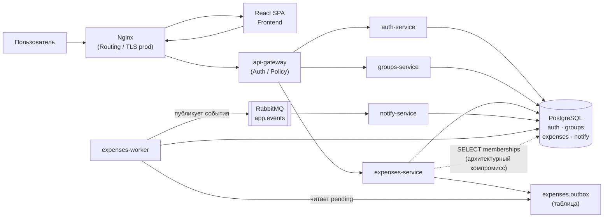

# 1.4 Проектирование архитектуры системы

Проектирование архитектуры является центральным этапом разработки любой распределённой информационной системы: именно на данном этапе определяется разбиение функциональности на компоненты, устанавливаются границы ответственности каждого из них и фиксируются механизмы межсервисного взаимодействия [5]. Опираясь на технологические решения, обоснованные в §1.3, в данном параграфе выполняется детальное проектирование компонентной архитектуры: определяется состав сервисов, описывается схема аутентификации на базе JWT RS256, проектируется событийная архитектура с применением паттерна Outbox и формулируется стратегия консистентности групповых балансов.

## 1.4.1 Компонентная архитектура системы

Система состоит из восьми развёртываемых компонентов: пяти доменных сервисов, выделенных в §1.3 (auth-service, groups-service, expenses-service, expenses-worker, notify-service), и трёх инфраструктурных — Nginx, api-gateway и frontend. Все компоненты разворачиваются в виде отдельных контейнеров средствами Docker Compose [11]. Разбиение выполнено по принципу единственной ответственности: каждый сервис инкапсулирует строго ограниченную функциональную область и взаимодействует с остальными исключительно через определённые интерфейсы — HTTP/REST или брокер сообщений RabbitMQ [16].

**Nginx** выполняет функцию граничного (edge) сервера: принимает входящие запросы и маршрутизирует их к frontend-приложению либо к api-gateway. В production-конфигурации (`nginx.prod.conf`) Nginx принимает HTTPS-соединения и осуществляет TLS-терминацию (TLSv1.2/1.3, порт 443); в dev-конфигурации (`nginx.conf`) сервер работает в режиме HTTP на порту 80 — достаточном для локальной разработки. Помимо маршрутизации, Nginx очищает входящие HTTP-заголовки семейства `X-User-*` средствами директив, описанных в документации [22], — этот приём защиты от подделки идентификационных данных является принятой практикой gateway-pattern в микросервисной архитектуре [30]. Таким образом, Nginx является первой и единственной точкой входа в систему из внешней сети.

**api-gateway** является доверенной точкой формирования identity-контекста: он проверяет наличие и корректность токена в заголовке `Authorization: Bearer`, валидирует JWT по публичному ключу auth-service и — при успешной валидации — формирует заголовки `X-User-*`, содержащие идентификатор и роль пользователя, после чего проксирует запрос к соответствующему backend-сервису. Backend-сервисы принимают идентификационный контекст исключительно из заголовков, сформированных api-gateway, и не выполняют самостоятельной валидации JWT.

**Frontend (React 19 + Vite, SPA)** реализует пользовательский интерфейс как одностраничное приложение: рендеринг выполняется на стороне клиента, а статический бандл отдаётся через Nginx [22]. Серверное состояние (запросы к API, кеш, инвалидация) изолировано в TanStack Query, клиентское состояние аутентификации — в Zustand [24, 35]. Взаимодействие с backend осуществляется через Nginx и api-gateway; для отображения актуальных данных об изменениях в группе применяется механизм периодического опроса (polling).

**auth-service** отвечает за регистрацию и аутентификацию пользователей, выдачу пар токенов (access + refresh), реализацию механизма token-family rotation refresh token и отзыв токенов при выходе из системы. Сервис хранит приватный ключ RS256; все остальные компоненты располагают только соответствующим публичным ключом. Пароли хранятся исключительно в виде хэша, вычисленного по алгоритму Argon2; подробная схема хранения учётных данных и сессий рассматривается в §1.5.2. Хранение токенов и учётных данных выполняется в схеме `auth` базы данных PostgreSQL.

**groups-service** отвечает за создание групп, управление участниками, обработку приглашений и назначение ролей (`owner`, `admin`, `member`). Сервис является единственным источником истины о членстве в группах; его схема `groups` в PostgreSQL содержит таблицы групп, участников и приглашений.

**expenses-service** реализует основную бизнес-логику приложения: хранение расходов, правила их распределения, расчёт балансов, операции взаиморасчёта (settlement), ведение журнала аудита критичных действий и генерацию доменных событий. Ключевые внутренние модули сервиса: `split_engine` — разбиение суммы расхода между участниками; `balance_engine` — on-demand расчёт текущих балансов из ledger-таблиц; `outbox` — таблица исходящих доменных событий для асинхронной доставки уведомлений. Отдельно отмечается осознанный архитектурный компромисс: для проверки членства пользователя в группе expenses-service выполняет прямой `SELECT` к таблице `groups.memberships`, что позволяет избежать синхронного HTTP-вызова к groups-service и исключает соответствующий источник задержки и отказов.

**expenses-worker** развёртывается как отдельный контейнер из образа expenses-service и выполняет задачи публикации сообщений: читает накопленные записи из таблицы `expenses.outbox` со статусом `pending`, публикует их в RabbitMQ exchange `app.events` типа `topic` и организует повторную доставку для событий, не опубликованных вследствие временных сбоев.

**notify-service** подписан на очередь брокера RabbitMQ, идемпотентно обрабатывает поступающие доменные события и формирует email-уведомление для участников групп, фиксируя факт доставки в таблице `notify.notification_deliveries`. Реальная отправка сообщений по SMTP активируется в production-конфигурации через переменную `EMAIL_BACKEND=smtp` и соответствующие SMTP-параметры из `docker-compose.prod.yml`. В dev-режиме сформированный шаблон уведомления сохраняется в структурированный лог (`EMAIL_BACKEND=logging`); сценарии оповещений тестируются без подключения к почтовому серверу. Сервис не публикуется во внешнюю сеть и взаимодействует исключительно с RabbitMQ и базой данных (схема `notify`).

Взаимодействие всех компонентов системы представлено на диаграмме компонентов (Рисунок 1.1). На диаграмме отражены синхронные HTTP-соединения (сплошные стрелки) и асинхронные зависимости через брокер сообщений, а также выделен компромисс прямого обращения expenses-service к таблице членства (пунктирная стрелка).

Рисунок 1.1 — Компонентная архитектура системы

Разбиение на сервисы, отражённое на рисунке 1.1, допускает независимое масштабирование и развёртывание каждого компонента. При временной недоступности notify-service операции с расходами и балансами продолжают работать: события накапливаются в outbox и доставляются после восстановления брокера. Nginx выступает единственной точкой входа, скрывая внутреннюю топологию сети от внешних клиентов.

## 1.4.2 Схема аутентификации и безопасности

Безопасность системы строится на нескольких взаимосвязанных механизмах, формирующих последовательные рубежи защиты от несанкционированного доступа.

**Схема JWT RS256.** Для аутентификации применяется асимметричная схема подписи токенов — RS256 (RSA Signature with SHA-256), использующая алгоритм RSA с хэш-функцией SHA-256. Выбор асимметричной схемы обусловлен архитектурными соображениями: auth-service хранит приватный ключ и единственный формирует токены, тогда как остальные сервисы располагают только публичным ключом и способны верифицировать подпись без необходимости обращаться к auth-service при каждом запросе. Это исключает auth-service из критического пути каждого входящего запроса и повышает общую отказоустойчивость системы.

Состав claims access token соответствует стандарту RFC 7519 [32]: `sub` (идентификатор пользователя), `iss` (issuer), `aud` (audience), `iat`/`nbf`/`exp` (временны́е метки выдачи, начала действия и истечения срока), `jti` (уникальный идентификатор токена, используемый для детектирования повторного использования). Email пользователя в claims не включается; при необходимости backend-сервисы получают его через выделенный API auth-service.

Access token имеет короткий срок действия (типично 15 минут), что ограничивает временное окно компрометации при его перехвате. Refresh token выдаётся на более длительный срок и хранится в защищённом HTTP-only cookie, недоступном для JavaScript-кода клиентского приложения.

**Token-family rotation refresh token.** Реализован механизм token-family rotation. В отличие от схемы с булевым флагом `revoked`, данный подход позволяет обнаружить факт повторного использования украденного refresh-токена и немедленно аннулировать всё семейство сессий пользователя. При каждом обращении к эндпоинту обновления токенов auth-service создаёт новую запись в таблице `auth.refresh_sessions` с тем же `token_family_id`, а предыдущая запись помечается статусом `rotated`. Если поступает запрос с refresh-токеном, уже находящимся в статусе `rotated` (признак повторного использования ротированного токена) либо `revoked` (после выхода из системы), это однозначно свидетельствует о компрометации: вся family немедленно переводится в статус `compromised`, что инициирует принудительный выход пользователя из всех активных сессий. Подробная структура таблицы `auth.refresh_sessions` рассматривается в §1.5.2.

**api-gateway как trust boundary.** Все запросы, поступающие к backend-сервисам, проходят через api-gateway, который выступает единственной доверенной точкой формирования identity-контекста. Схема обработки запроса выглядит следующим образом:

1. Nginx принимает запрос, очищает заголовки `X-User-*` и перенаправляет трафик к api-gateway.
2. api-gateway извлекает JWT из заголовка `Authorization`, верифицирует подпись по публичному ключу RS256 и проверяет срок действия токена.
3. При успешной валидации api-gateway формирует заголовок `X-User-Id` со значением claim `sub` и проксирует запрос к целевому backend-сервису.
4. Backend-сервис принимает идентификационный контекст из этого заголовка как доверенный, не производя повторной валидации JWT. Роль участника в группе в заголовке не передаётся: она определяется backend-сервисом (groups-service, expenses-service) чтением таблицы `groups.memberships` при каждой проверке прав доступа, что делает авторизацию независимой от содержимого токена.

Принципиально важно, что backend-сервисы никогда не получают заголовки `X-User-*` напрямую от клиента: Nginx гарантированно удаляет их из входящих запросов до передачи api-gateway. Таким образом, единственным легитимным источником identity-контекста для backend является api-gateway.

**Ролевая модель доступа.** Внутри каждой группы пользователям назначается одна из трёх ролей: `owner` (создатель группы, полный контроль), `admin` (управление участниками и расходами), `member` (просмотр и добавление расходов). Проверка принадлежности пользователя к группе и его роли выполняется на уровне expenses-service и groups-service.

**Дополнительные меры защиты.** В production-конфигурации (`nginx.prod.conf`) на эндпоинты аутентификации применяется rate limiting средствами Nginx [22]: для `/auth/login` установлено ограничение 5 запросов в минуту, для `/auth/refresh` — 30 запросов в минуту, что существенно ограничивает возможность атак методом перебора учётных данных. В dev-конфигурации лимиты не применяются, чтобы не затруднять локальное тестирование. Критичные действия — создание расходов, проведение взаиморасчётов, изменение состава группы — фиксируются в журнале аудита в базе данных. Все межсервисные коммуникации происходят во внутренней Docker-сети, недоступной из внешней среды.

## 1.4.3 Событийная архитектура

Уведомление участников группы о финансовых событиях (добавление расхода, проведение взаиморасчёта) реализовано посредством асинхронной событийной архитектуры на базе брокера RabbitMQ [7]. Ключевая задача проектирования данного компонента — обеспечить надёжную доставку событий при сохранении транзакционной консистентности с основными операциями: уведомление должно быть отправлено тогда и только тогда, когда соответствующая операция успешно зафиксирована в базе данных.

**Паттерн Outbox.** В соответствии с принятым архитектурным решением (§1.3) для обеспечения транзакционной консистентности применяется паттерн Outbox [4]: при создании расхода или проведении взаиморасчёта в рамках одной атомарной транзакции PostgreSQL выполняются два действия — сохранение основных данных операции и запись соответствующего доменного события в таблицу `outbox` со статусом `pending`. Таким образом, либо оба действия зафиксированы, либо ни одно из них — транзакционная гарантия PostgreSQL исключает ситуацию частичного применения.

**expenses-worker и публикация событий.** Компонент expenses-worker реализует цикл опроса таблицы `outbox`: в каждой итерации он выбирает накопленные события со статусом `pending`, публикует их в RabbitMQ exchange `app.events` типа `topic` и обновляет статус записей на `delivered`. При сбое на этапе публикации запись остаётся в статусе `pending` и будет обработана в следующей итерации. Такой подход обеспечивает семантику доставки «не менее одного раза» (at-least-once delivery) [16].

Routing keys событий соответствуют типу выполненной операции: `expense.created` — при создании расхода, `settlement.created` — при проведении взаиморасчёта. Использование топологии `topic` позволяет потребителям подписываться как на конкретные типы событий, так и на их группы по маске.

**notify-service и идемпотентная обработка.** notify-service подписан на очередь, привязанную к exchange `app.events`. При получении сообщения сервис проверяет, не было ли данное событие обработано ранее — идентификатор события сохраняется в базе данных после первой успешной обработки. Если событие уже обработано (дублирующая доставка вследствие at-least-once семантики), сервис подтверждает получение сообщения (`ack`) без повторного формирования уведомления. Такая схема обеспечивает эффект однократной обработки (effectively-once) на прикладном уровне: транспорт сохраняет семантику at-least-once, а повторные доставки отсекаются проверкой идентификатора события в `processed_events` [7].

**Dead letter queue.** Для сообщений, которые не удалось обработать после исчерпания допустимого числа попыток (например, вследствие некорректного формата или постоянного сбоя обработчика), настроена очередь недоставленных сообщений (dead letter queue, DLQ). Перенаправление в DLQ снимает блокировку основной очереди и удерживает повреждённые сообщения для отдельного разбора [16].

Описанная схема разделяет expenses-service и notify-service: учёт расходов не зависит от доступности сервиса уведомлений. При временной недоступности notify-service события накапливаются в очереди RabbitMQ и обрабатываются после восстановления соединения.

## 1.4.4 Стратегия консистентности балансов

Расчёт текущих балансов участников группы предполагает агрегацию данных по нескольким связанным таблицам: расходам, долям участников и проведённым взаиморасчётам. В зависимости от ожидаемой нагрузки и требований к актуальности данных для подобных задач применяются различные стратегии — от вычисления по запросу до кэширования с инкрементальным обновлением. В рамках разрабатываемой системы реализуется двухэтапный подход, соответствующий стадиям развития продукта.

**v1. Вычисление балансов по запросу (on-demand).** В актуальной реализации баланс каждого участника группы вычисляется непосредственно в момент обращения к соответствующему эндпоинту из данных ledger-таблиц: `expenses`, `expense_splits` и `settlements`. Алгоритм пересчёта строится следующим образом:

— суммируются значения `expense_splits.amount_minor` для данного пользователя в группе — это его суммарная доля в общих расходах группы (сколько он должен был заплатить);

— из полученной суммы вычитается совокупная величина `expenses.amount_minor` по записям, где пользователь указан как `paid_by_user_id` — то есть суммы, которые он фактически оплатил за группу;

— результат корректируется на суммы проведённых взаиморасчётов (`settlements`), в которых пользователь выступает либо отправителем (`from_user_id`), либо получателем (`to_user_id`).

Итоговое значение представляет собой баланс пользователя в группе: положительное означает, что другие участники суммарно должны ему, отрицательное — что он должен другим.

**Упрощение схемы расчётов: greedy-минимизация числа переводов.** Дополнительно к попарному представлению задолженностей реализована greedy-минимизация количества переводов с границей не более N−1, доступная через эндпоинт `GET /balances/simplified`. Теоретическое обоснование границы и алгоритм рассматриваются в §1.6.2.

**v2. Кэширование через `balance_snapshot` (направление развития).** При прогнозируемом росте нагрузки on-demand расчёт может стать узким местом: крупные группы с большой историей расходов потребуют агрегации значительного объёма данных при каждом запросе баланса. Для этого сценария в архитектурных документах проекта (`docs/architecture.md`, `docs/bd_architecture.md`) зафиксировано решение v2 — введение таблицы `balance_snapshot(group_id, user_id, balance, dirty, updated_at)` с dirty-флагом и стратегией read-through cache [4]: при модификации расходов снимок помечается устаревшим в той же транзакции, а при обращении к балансу выполняется пересчёт с обновлением кэша. Фоновая актуализация устаревших снимков в expenses-worker позволит распределить вычислительную нагрузку во времени. Данное решение не реализовано в v1 MVP и планируется к внедрению по мере масштабирования системы.

---

Принятые архитектурные решения сосредоточены вокруг сохранения финансовой корректности и возможности перехода к v2 без миграции данных. Проверка членства через cross-schema `SELECT` к `groups.memberships` устраняет синхронный HTTP-вызов между сервисами без дублирования данных и сопутствующей задачи их согласования; границы такого исключения изоляции зафиксированы явно и относятся только к чтению. Расхождение фактической схемы PostgreSQL с метаданными ORM-моделей блокируется schema-guard на старте сервиса, что делает применение миграций отдельной операцией и снимает риск молчаливого дрейфа схемы при перезапуске контейнера. Частичный уникальный индекс на `refresh_sessions(token_family_id) WHERE status = 'active'` фиксирует инвариант единственной активной сессии в семействе и делает детектирование повторного использования refresh-токена однозначным при параллельных вызовах `/auth/login` и `/auth/refresh`. Разделение v1 и v2 проведено так, чтобы развитие — введение `balance_snapshot`, курсорной пагинации истории, отдельной БД на сервис — не требовало изменений действующих контрактов API и DDL ledger-таблиц. В параграфе 1.5 на основе принятых архитектурных решений выполняется проектирование схем базы данных PostgreSQL для каждого из сервисов.
