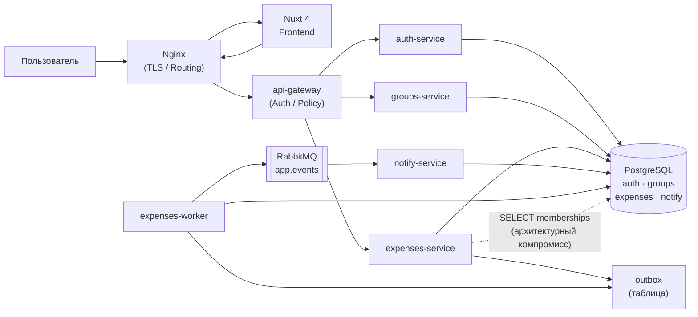

# 1.4 Проектирование архитектуры системы

Проектирование архитектуры является центральным этапом разработки любой распределённой информационной системы: именно на данном этапе определяется разбиение функциональности на компоненты, устанавливаются границы ответственности каждого из них и фиксируются механизмы межсервисного взаимодействия [6]. В рамках настоящего параграфа, опираясь на технологические решения, обоснованные в §1.3, выполняется детальное проектирование компонентной архитектуры разрабатываемой системы: определяется состав сервисов и их ответственности, описывается схема аутентификации на базе JWT RS256, проектируется событийная архитектура с применением паттерна Outbox, а также формулируется стратегия обеспечения консистентности групповых балансов.

## 1.4.1 Компонентная архитектура системы

Система состоит из восьми логических компонентов, развёртываемых в виде отдельных контейнеров средствами Docker Compose [12]. Разбиение на компоненты выполнено по принципу единственной ответственности: каждый сервис инкапсулирует строго ограниченную функциональную область и взаимодействует с остальными компонентами исключительно через определённые интерфейсы — HTTP/REST или брокер сообщений RabbitMQ [17].

**Nginx** выполняет функцию граничного (edge) сервера: принимает входящие HTTPS-соединения, осуществляет TLS-терминацию и маршрутизирует запросы к frontend-приложению либо к api-gateway. Помимо маршрутизации, Nginx очищает входящие HTTP-заголовки семейства `X-User-*`, предотвращая передачу клиентом поддельных идентификационных данных во внутреннюю сеть [23]. Таким образом, Nginx является первой и единственной точкой входа в систему из внешней сети.

**api-gateway** является доверенной точкой формирования identity-контекста: он проверяет наличие и корректность токена в заголовке `Authorization: Bearer`, валидирует JWT по публичному ключу auth-service и — при успешной валидации — формирует заголовки `X-User-*`, содержащие идентификатор и роль пользователя, после чего проксирует запрос к соответствующему backend-сервису. Backend-сервисы принимают идентификационный контекст исключительно из заголовков, сформированных api-gateway, и не выполняют самостоятельной валидации JWT.

**Frontend (Nuxt 4)** реализует пользовательский интерфейс с применением серверного рендеринга (SSR): первоначальная отрисовка страниц выполняется на сервере, что обеспечивает ускоренную загрузку и доступность контента для индексации [15]. Управление состоянием приложения реализовано посредством Pinia [25]. Взаимодействие с backend осуществляется через Nginx и api-gateway; для отображения актуальных данных об изменениях в группе применяется механизм периодического опроса (polling).

**auth-service** отвечает за регистрацию и аутентификацию пользователей, выдачу пар токенов (access + refresh), реализацию механизма rotation refresh token и отзыв токенов при выходе из системы. Сервис хранит приватный ключ RS256; все остальные компоненты располагают только соответствующим публичным ключом. Хранение учётных данных и токенов выполняется в схеме `auth` базы данных PostgreSQL.

**groups-service** обеспечивает управление группами пользователей: создание групп, управление участниками, обработку приглашений и назначение ролей (`owner`, `admin`, `member`). Сервис является единственным источником истины о членстве в группах; его схема `groups` в PostgreSQL содержит таблицы групп, участников и приглашений.

**expenses-service** реализует основную бизнес-логику приложения: хранение расходов, правила их распределения, расчёт балансов, операции взаиморасчёта (settlement), ведение журнала аудита критичных действий и генерацию доменных событий. Внутренняя структура сервиса включает следующие компоненты: `split_engine` — модуль разбиения суммы расхода между участниками; `balance_engine` — модуль расчёта текущих балансов; `balance_snapshot` — кэш балансовых значений со стратегией read-through; `outbox` — таблица исходящих доменных событий. Отдельно отмечается осознанный архитектурный компромисс: для проверки членства пользователя в группе expenses-service выполняет прямой `SELECT` к таблице `groups.memberships`, что позволяет избежать синхронного HTTP-вызова к groups-service и исключает соответствующий источник задержки и отказов.

**expenses-worker** развёртывается как отдельный контейнер из образа expenses-service и выполняет фоновые задачи: публикацию накопленных записей из таблицы `outbox` в RabbitMQ exchange `app.events` типа `topic`, организацию повторной доставки для неопубликованных событий, а также актуализацию снимков балансов (`balance_snapshot`) в фоновом режиме.

**notify-service** подписан на очередь брокера RabbitMQ, идемпотентно обрабатывает поступающие доменные события и формирует email-уведомления для участников групп. Сервис не публикуется во внешнюю сеть и взаимодействует исключительно с RabbitMQ и базой данных (схема `notify`).

Взаимодействие всех компонентов системы представлено на диаграмме компонентов (Рисунок 1.1). На диаграмме отражены синхронные HTTP-соединения (сплошные стрелки) и асинхронные зависимости через брокер сообщений, а также выделен компромисс прямого обращения expenses-service к таблице членства (пунктирная стрелка).

Рисунок 1.1 — Компонентная архитектура системы

Разбиение на сервисы, отражённое на рисунке 1.1, обеспечивает независимое масштабирование и развёртывание каждого компонента. В случае временной недоступности notify-service функциональность основных операций с расходами и балансами не нарушается: события сохраняются в outbox и будут доставлены при восстановлении брокера. Nginx выступает единственной точкой входа, скрывая внутреннюю топологию сети от внешних клиентов.

## 1.4.2 Схема аутентификации и безопасности

Безопасность системы строится на нескольких взаимосвязанных механизмах, формирующих последовательные рубежи защиты от несанкционированного доступа.

**Схема JWT RS256.** Для аутентификации применяется асимметричная схема подписи токенов — RS256 (RSA Signature with SHA-256) — схема асимметричной цифровой подписи, использующая алгоритм RSA с хэш-функцией SHA-256. Выбор асимметричной схемы обусловлен архитектурными соображениями: auth-service хранит приватный ключ и единственный формирует токены, тогда как остальные сервисы располагают только публичным ключом и способны верифицировать подпись без необходимости обращаться к auth-service при каждом запросе [5]. Это исключает auth-service из критического пути каждого входящего запроса и повышает общую отказоустойчивость системы.

Access token имеет короткий срок действия (типично 15 минут), что ограничивает временное окно компрометации при его перехвате. Refresh token выдаётся на более длительный срок и хранится в защищённом HTTP-only cookie, недоступном для JavaScript-кода клиентского приложения.

**Rotation refresh token.** При каждом обращении к эндпоинту обновления токенов auth-service выдаёт новый refresh token и одновременно инвалидирует предыдущий, фиксируя это в базе данных. Данный механизм позволяет обнаруживать факты повторного использования уже отозванных токенов: если скомпрометированный токен будет использован злоумышленником, система зафиксирует конфликт и может инициировать принудительный выход из всех сессий [5].

**api-gateway как trust boundary.** Все запросы, поступающие к backend-сервисам, проходят через api-gateway, который выступает единственной доверенной точкой формирования identity-контекста. Схема обработки запроса выглядит следующим образом:

1. Nginx принимает запрос, очищает заголовки `X-User-*` и перенаправляет трафик к api-gateway.
2. api-gateway извлекает JWT из заголовка `Authorization`, верифицирует подпись по публичному ключу RS256 и проверяет срок действия токена.
3. При успешной валидации api-gateway формирует заголовки `X-User-Id` и `X-User-Email` и проксирует запрос к целевому backend-сервису.
4. Backend-сервис принимает идентификационный контекст из этих заголовков как доверенный, не производя повторной валидации JWT.

Принципиально важно, что backend-сервисы никогда не получают заголовки `X-User-*` напрямую от клиента: Nginx гарантированно удаляет их из входящих запросов до передачи api-gateway. Таким образом, единственным легитимным источником identity-контекста для backend является api-gateway.

**Ролевая модель доступа.** Внутри каждой группы пользователям назначается одна из трёх ролей: `owner` (создатель группы, полный контроль), `admin` (управление участниками и расходами), `member` (просмотр и добавление расходов). Проверка принадлежности пользователя к группе и его роли выполняется на уровне expenses-service и groups-service.

**Дополнительные меры защиты.** На эндпоинты аутентификации (`/auth/login`, `/auth/refresh`) применяется rate limiting средствами Nginx [23], что ограничивает возможность атак методом перебора учётных данных. Критичные действия — создание расходов, проведение взаиморасчётов, изменение состава группы — фиксируются в журнале аудита в базе данных. Все межсервисные коммуникации происходят во внутренней Docker-сети, недоступной из внешней среды.

## 1.4.3 Событийная архитектура

Уведомление участников группы о финансовых событиях (добавление расхода, проведение взаиморасчёта) реализовано посредством асинхронной событийной архитектуры на базе брокера RabbitMQ [8]. Ключевая задача проектирования данного компонента — обеспечить надёжную доставку событий при сохранении транзакционной консистентности с основными операциями: уведомление должно быть отправлено тогда и только тогда, когда соответствующая операция успешно зафиксирована в базе данных.

**Паттерн Outbox.** В соответствии с принятым архитектурным решением (§1.3) для обеспечения транзакционной консистентности применяется паттерн Outbox [5]: при создании расхода или проведении взаиморасчёта в рамках одной атомарной транзакции PostgreSQL выполняются два действия — сохранение основных данных операции и запись соответствующего доменного события в таблицу `outbox` со статусом `pending`. Таким образом, либо оба действия зафиксированы, либо ни одно из них — транзакционная гарантия PostgreSQL исключает ситуацию частичного применения.

**expenses-worker и публикация событий.** Компонент expenses-worker реализует цикл опроса таблицы `outbox`: в каждой итерации он выбирает накопленные события со статусом `pending`, публикует их в RabbitMQ exchange `app.events` типа `topic` и обновляет статус записей на `delivered`. При сбое на этапе публикации запись остаётся в статусе `pending` и будет обработана в следующей итерации. Такой подход обеспечивает семантику доставки «не менее одного раза» (at-least-once delivery) [17].

Routing keys событий соответствуют типу выполненной операции: `expense.created` — при создании расхода, `settlement.created` — при проведении взаиморасчёта. Использование топологии `topic` позволяет потребителям подписываться как на конкретные типы событий, так и на их группы по маске.

**notify-service и идемпотентная обработка.** notify-service подписан на очередь, привязанную к exchange `app.events`. При получении сообщения сервис проверяет, не было ли данное событие обработано ранее — идентификатор события сохраняется в базе данных после первой успешной обработки. Если событие уже обработано (дублирующая доставка вследствие at-least-once семантики), сервис подтверждает получение сообщения (`ack`) без повторного формирования уведомления. Такая схема гарантирует, что каждое уведомление будет отправлено пользователю ровно один раз, несмотря на возможность многократной доставки сообщения брокером [8].

**Dead letter queue.** Для сообщений, которые не удалось обработать после исчерпания допустимого числа попыток (например, вследствие некорректного формата или постоянного сбоя обработчика), настроена очередь недоставленных сообщений (dead letter queue, DLQ). Перенаправление в DLQ предотвращает блокировку основной очереди и позволяет проводить анализ причин отказов в контролируемых условиях [17].

Описанная схема событийной архитектуры обеспечивает слабую связанность между expenses-service и notify-service: основной функционал учёта расходов не зависит от доступности сервиса уведомлений. При временной недоступности notify-service события накапливаются в очереди RabbitMQ и будут обработаны после восстановления соединения.

## 1.4.4 Стратегия консистентности балансов

Расчёт текущих балансов участников группы является ресурсоёмкой операцией: для получения точного значения баланса каждого участника необходимо агрегировать данные по всем расходам и транзакциям взаиморасчёта в группе. При частом обращении к балансовым данным (что характерно для интерфейса приложения, отображающего актуальные значения при каждом открытии страницы группы) повторное вычисление при каждом запросе создаёт значительную нагрузку на базу данных.

**balance_snapshot и стратегия dirty + read-through.** Для снижения нагрузки применяется механизм кэширования балансов — таблица `balance_snapshot`, хранящая актуальные значения балансов для каждого участника группы. Стратегия управления кэшем строится следующим образом:

— при создании расхода, его изменении или проведении взаиморасчёта соответствующий снимок баланса для данной группы помечается как устаревший (`dirty = true`) в той же транзакции, что и основная операция;

— при обращении к балансу проверяется состояние снимка: если снимок актуален (`dirty = false`), возвращается сохранённое значение; если снимок помечен как устаревший, выполняется полный пересчёт баланса из исходных данных (read-through), результат сохраняется в снимке и снимается флаг `dirty`.

Данная стратегия гарантирует, что пользователь всегда получает корректное значение баланса — пересчёт выполняется по требованию при наличии изменений. В период между изменениями повторные запросы обслуживаются из кэша без обращения к агрегирующим запросам.

**Фоновая актуализация.** Помимо пересчёта по требованию, expenses-worker выполняет периодическую актуализацию снимков в фоновом режиме: он выбирает из базы данных записи с флагом `dirty = true` и принудительно пересчитывает балансы для соответствующих групп. Это позволяет распределить вычислительную нагрузку во времени и снизить вероятность длительных read-through пересчётов при одновременном обращении множества пользователей к одной группе.

Выбранная стратегия представляет собой применение известного паттерна read-through cache [5] к специфике финансовых расчётов и обеспечивает приемлемое время отклика при чтении балансовых данных без ущерба для их корректности.

---

Таким образом, в рамках данного параграфа спроектирована компонентная архитектура системы, включающая восемь функциональных компонентов с разграниченными зонами ответственности. Определена схема аутентификации на основе JWT RS256 с механизмом rotation refresh token, при которой api-gateway выступает единственным доверенным источником identity-контекста для backend-сервисов. Спроектирована событийная архитектура на базе паттерна Outbox, обеспечивающая транзакционную консистентность между операциями с расходами и публикацией доменных событий в RabbitMQ. Определена стратегия консистентности балансов с применением dirty-флага и read-through пересчёта. В параграфе 1.5 на основе принятых архитектурных решений выполняется проектирование схем базы данных PostgreSQL для каждого из сервисов.
