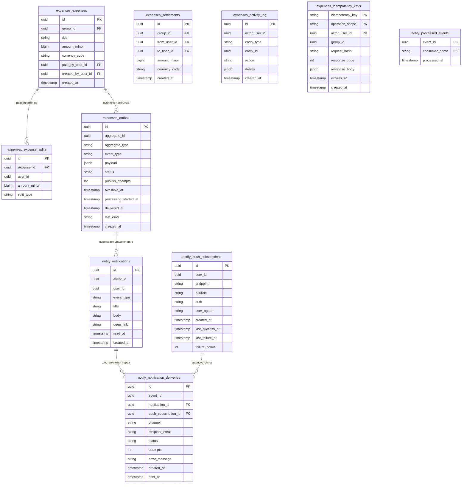

# 1.5 Проектирование базы данных и API

Параграф объединяет два уровня контракта системы. На уровне хранения проектируется реляционная схема: сущности распределяются по логическим схемам PostgreSQL, ссылочная и доменная целостность поддерживаются совместно средствами СУБД и приложения. На уровне внешнего взаимодействия проектируется REST API: формулируются принципы версионирования, идемпотентности и передачи идентичности, а также описывается контракт каждого из трёх backend-сервисов. Объединение продиктовано преемственностью: структура таблиц напрямую определяет тела ответов, ограничения СУБД дублируются валидационными инвариантами API, а механизмы идемпотентности и аудита реализуются совместно на двух уровнях. В качестве системы управления реляционными базами данных применяется PostgreSQL — одна из наиболее зрелых и функционально насыщенных СУБД с открытым исходным кодом, поддерживающая полный набор гарантий ACID, расширенные типы данных и механизм логических схем [15].

## 1.5.1 Принципы организации хранения данных

Концепция хранения данных строится на использовании единой физической базы данных PostgreSQL при обеспечении логической изоляции между сервисами через механизм схем. Данный подход согласуется с принятой сервисной архитектурой: каждый backend-сервис взаимодействует исключительно с собственной схемой и не имеет прямого доступа к таблицам других сервисов через SQL-запросы — взаимодействие между доменами осуществляется через HTTP-API или очередь сообщений [4].

Изоляция реализуется посредством раздельных пользователей PostgreSQL: каждому сервису соответствует отдельная роль в СУБД, наделённая привилегиями исключительно на собственную схему. Так, сервис аутентификации работает от пользователя `auth_user` с правами на схему `auth`, сервис групп — от `groups_user` на схему `groups`, а сервис расходов (`expenses-service`) и его фоновый обработчик (`expenses-worker`) совместно используют пользователя `expenses_user` на схему `expenses`. Сервис уведомлений эксплуатирует пользователя `notify_user` на схему `notify`.

Применение схем в рамках единой базы данных, а не отдельных баз данных на каждый сервис, обосновано несколькими соображениями. Во-первых, сокращаются операционные издержки: управление резервным копированием, мониторингом и конфигурацией выполняется централизованно. Во-вторых, сохраняется возможность применения транзакций при необходимости выполнить атомарные операции, затрагивающие несколько схем. В-третьих, изоляция между сервисами поддерживается на уровне ролей и привилегий PostgreSQL [8].

Из правила межсервисной изоляции сделаны три задокументированных исключения для перекрёстных операций чтения, снимающих синхронные HTTP-вызовы на критических путях. Сервис расходов получает `SELECT` на схему `groups`, что позволяет проверять факт членства пользователя непосредственно в SQL-запросе на критическом пути создания расхода. Сервис уведомлений получает `SELECT` на схему `auth` (резолв адреса получателя при отправке писем) и на схему `groups` (формирование персонализированных уведомлений с указанием названия группы). Сервис групп получает `SELECT` на схему `auth` для обогащения списка участников полем `display_name` без обращения к API auth-сервиса. Технически перечисленные привилегии выдаются механизмом `ALTER DEFAULT PRIVILEGES` от имени роли-владельца целевой схемы, поскольку PostgreSQL не поддерживает column-scope в этом механизме: фактически роль получает table-level `SELECT` на все будущие таблицы схемы, а не на отдельные столбцы. Альтернатива cross-schema чтения — цепочка синхронных HTTP-вызовов между сервисами на критическом пути; она увеличивает задержку и связанность доменов, поэтому в v1 предпочтено прямое чтение.

Всего в базе данных предусмотрено четыре логические схемы:

- **auth** — данные пользователей и токены обновления;
- **groups** — группы, членство и приглашения;
- **expenses** — расходы, доли, взаиморасчёты, балансы и вспомогательные таблицы;
- **notify** — уведомления и журнал обработанных событий.

## 1.5.2 Схема auth

Схема `auth` содержит две таблицы, обеспечивающие хранение учётных данных пользователей и управление сессиями через механизм refresh-токенов.

Таблица `users` является центральным справочником пользователей системы. Первичный ключ `id` реализован как UUID-v4, генерируемый на уровне приложения, что исключает зависимость от последовательного инкремента и упрощает горизонтальное масштабирование. Поле `email` снабжено ограничением `UNIQUE` и `NOT NULL`; пароль хранится исключительно в виде хэша (`password_hash`), вычисленного по алгоритму **Argon2**. Выбор алгоритма обусловлен рекомендациями OWASP Password Storage Cheat Sheet [33] и его устойчивостью к атакам с применением GPU и специализированных ASIC: будучи memory-hard-функцией, Argon2 требует значительного объёма оперативной памяти при вычислении, что делает массовый перебор паролей экономически нецелесообразным даже при наличии специализированного оборудования. Поле `display_name` хранит отображаемое имя пользователя, под которым он виден в составе участников группы, на балансах и в журнале операций; на длину наложено ограничение `CHECK (length(display_name) BETWEEN 1 AND 80)`. Поле `created_at` фиксирует момент регистрации и заполняется автоматически функцией `now()`.

Таблица `auth.refresh_sessions` связана с `users` внешним ключом `user_id` с каскадным удалением: при удалении пользователя все его сессии удаляются автоматически. Хранится хэш токена (`refresh_token_hash`), а не сам токен, что предотвращает его компрометацию при утечке базы данных. Схема сессии включает поля: `id` (PK), `user_id` (FK, CASCADE), `token_family_id` (UUID), `refresh_token_hash`, `status` (перечислимый тип: `active` / `rotated` / `expired` / `logged_out` / `revoked` / `compromised`, ограничение домена закреплено `CHECK`-условием на стороне СУБД), временны́е метки `created_at`, `expires_at`, `rotated_at`, `revoked_at`.

Структура таблицы поддерживает разграничение штатного и аномального завершения сессии: значения `expired` и `logged_out` фиксируют истечение срока действия и явный выход пользователя, тогда как `rotated`, `revoked` и `compromised` обслуживают логику ротации и реакции на повторное использование refresh-токена. Поле `token_family_id` связывает между собой записи одной цепочки ротаций, а частичный уникальный индекс `uq_auth_refresh_one_active_per_family` (§1.5.6) ограничивает число одновременно активных сессий в семействе одной записью. Механизм token-family rotation, использующий эти поля, рассматривается в §1.4.2.

Связь между таблицами: `auth.refresh_sessions.user_id → auth.users.id` (многие-к-одному, каскадное удаление).

Помимо `users` и `refresh_sessions`, схема `auth` включает служебную таблицу `audit_log` для фиксации значимых событий аутентификации (вход, отказ, ротация, отзыв сессии). Состав полей: `id`, `user_id` (nullable — для событий, не привязанных к конкретному пользователю), `action_type`, `data` (JSONB), `created_at`. Таблица предназначена для последующего разбора инцидентов безопасности и мониторинга подозрительной активности.

## 1.5.3 Схема groups

Схема `groups` содержит три таблицы, описывающие социальную структуру приложения: группы пользователей, членство в них и систему приглашений.

Таблица `groups` хранит базовые атрибуты группы: уникальный идентификатор `id` (UUID), наименование группы `title`, идентификатор создателя `created_by_user_id` (ссылка на `auth.users.id`), поле `default_currency_code` (трёхбуквенный код ISO 4217), перечислимый `status` (`active` / `archived`) и метку времени создания `created_at`. Поле `created_by_user_id` не несёт операционной нагрузки для проверки прав доступа — авторизация осуществляется через таблицу `memberships`, — однако хранится для исторической атрибуции и быстрого определения первоначального создателя группы. Поле `default_currency_code` устанавливает валюту по умолчанию для новых расходов группы, избавляя участников от необходимости указывать валюту при каждом добавлении расхода. Статус `archived` переводит завершённые поездки или совместные проекты в режим read-only: история расходов сохраняется в неизменном виде, новые операции не принимаются.

Таблица `memberships` реализует отношение многие-ко-многим между пользователями и группами. Состав полей: суррогатный первичный ключ `id` (UUID), идентификаторы группы (`group_id`) и пользователя (`user_id`), поле `role` с перечислимым типом, принимающим одно из трёх значений: `owner`, `admin`, `member`, поле `status` (перечислимый тип `active` / `left` / `removed`), фиксирующее жизненный цикл участия, и временна́я метка `created_at`. Пара (`group_id`, `user_id`) объявлена уникальной — один пользователь не может состоять в одной группе более чем с одной записью членства. Введение явного поля `status` вместо физического удаления записи о вышедшем участнике сохраняет историческую атрибуцию: расходы и взаиморасчёты, в которых пользователь участвовал ранее, остаются согласованными по ссылочной целостности.

Таблица `invitations` хранит приглашения новых участников. В реализованном варианте (v1) приглашения адресуются **только зарегистрированным пользователям** через поле `target_user_id`. Состав полей: `id`, `group_id`, `target_user_id` (ссылка на `auth.users.id`), `created_by_user_id` (пригласивший участник), `role` (роль, с которой приглашаемый войдёт в группу при принятии приглашения), `status` (перечислимый тип: `pending`, `accepted`, `declined`), `created_at`, `expires_at`. Поле `expires_at` определяет срок действия приглашения: по истечении установленного периода приглашение становится недействительным, что предотвращает накопление «висящих» записей и делает поведение системы предсказуемым. Внешние ключи `group_id → groups.id` и `target_user_id → auth.users.id` обеспечивают ссылочную целостность. Email-приглашения с автогенерацией одноразового токена (для пользователей, ещё не зарегистрированных в системе) предусмотрены как направление развития v2; в текущей реализации приглашение возможно только пользователю, уже создавшему аккаунт.

Дополнительно схема `groups` включает таблицу `audit_log` для журналирования организационных действий: создание группы, изменение состава участников, выдача и отзыв приглашений. Состав полей: `id`, `group_id` (nullable), `actor_user_id` (nullable — пользователь, инициировавший действие), `action_type`, `data` (JSONB), `created_at`. Назначение таблицы — отслеживание административных операций в группе и разбор спорных ситуаций между участниками.

## 1.5.4 Схема expenses

Схема `expenses` является наиболее сложной по структуре и содержит шесть таблиц, охватывающих весь жизненный цикл финансовых операций: от фиксации расхода и обеспечения идемпотентности операций до гарантированной публикации событий и ведения журнала активности. Таблицы схемы: `expenses`, `expense_splits`, `settlements`, `activity_log`, `idempotency_keys`, `outbox`. Таблица `balance_snapshot` в схеме v1 отсутствует — балансы вычисляются on-demand из таблиц ledger; её введение рассматривается как направление развития v2 (см. §1.4.4).

**Денежная модель.** Все денежные значения в схеме хранятся как `BigInteger amount_minor` — целое число в **минимальных единицах валюты** (копейки для RUB, центы для USD и EUR и т.д.). Тот же тип применяется на всём пути от базы данных до REST API без промежуточных конвертаций. Целочисленная арифметика устраняет ошибки округления, характерные для типов с плавающей точкой; единообразная валидация на уровне API и БД задаётся ограничением `CHECK (amount_minor > 0)`; сериализация в JSON остаётся однозначной (в отличие от `DECIMAL`, трактовка которого разными JSON-библиотеками может расходиться); хранение получается компактнее, чем у `NUMERIC(15,2)`. Применение чисел с плавающей точкой для финансовых расчётов недопустимо ввиду накопления ошибок округления при последовательном делении и сложении.

Валюта фиксируется на уровне каждой записи полем `currency_code` (трёхбуквенный код стандарта ISO 4217). Группа и расходы хранят валюту независимо: `groups.default_currency_code` задаёт значение по умолчанию для новых расходов, тогда как `expenses.currency_code` отражает фактическую валюту конкретного расхода. Правила формирования долей при равномерном распределении (целочисленное деление с зачислением остатка плательщику) выполняются в клиентском коде; сервер принимает готовый список долей и валидирует инвариант суммы (формула 1.4 в §1.6). Перенос расчёта на клиент устраняет необходимость передачи флага режима распределения по сети и сохраняет за серверным слоем единственную ответственность — проверку соответствия суммы долей сумме расхода.

**Таблица `expenses`** фиксирует каждый расход группы. Основные поля: `id` (UUID), `group_id` (ссылка на `groups.groups.id`), `title` (наименование расхода), `amount_minor` (BigInteger), `currency_code` (ISO 4217), `paid_by_user_id` (ссылка на `auth.users.id` — пользователь, фактически оплативший расход), `created_by_user_id` (ссылка на `auth.users.id` — пользователь, создавший запись). Разделение полей `paid_by_user_id` и `created_by_user_id` поддерживает сценарии, при которых один участник вносит расход в систему от имени другого, и сохраняет аудитную трассу всех изменений. Ограничение `CHECK (amount_minor > 0)` гарантирует положительность суммы расхода. Индексы предусмотрены на `group_id` и `created_at` для эффективной фильтрации истории расходов по группе.

**Таблица `expense_splits`** хранит распределение расхода по участникам. Каждая запись связывает расход (`expense_id → expenses.id`, каскадное удаление) с конкретным пользователем (`user_id`) и зафиксированной долей (`amount_minor` — BigInteger в минимальных единицах валюты). Поле `split_type` фиксирует режим формирования доли — `equal` (доля рассчитана равномерным распределением) или `custom` (доля задана клиентом явно) — и используется для информативного отображения при просмотре истории расходов; значение по умолчанию `custom` подставляется при отсутствии явного указания со стороны клиента. Ограничение `CHECK (amount_minor > 0)` гарантирует положительность каждой доли. Агрегатный инвариант — сумма всех долей по одному `expense_id` равна `amount_minor` соответствующего расхода — обеспечивается на уровне приложения при создании расхода в транзакции.

**Таблица `settlements`** регистрирует акты погашения задолженности между двумя участниками группы. Поля `from_user_id` и `to_user_id` ссылаются на `auth.users.id`; поле `group_id` привязывает расчёт к группе. Ограничение `CHECK (from_user_id <> to_user_id)` исключает самозачёт — участник не может зафиксировать перевод средств самому себе. Каждый settlement атомарно обновляет балансы обоих участников в рамках одной транзакции.

**Таблица `idempotency_keys`** поддерживает идемпотентность критичных POST-операций: `POST /expenses` и `POST /settlements`. Составной первичный ключ `(idempotency_key, operation_scope, actor_user_id)` исключает коллизии между пользователями и различными типами операций: `idempotency_key` приходит от клиента в HTTP-заголовке `Idempotency-Key` согласно IETF-драфту [31], `operation_scope` различает идемпотентность в разрезе типа операции, `actor_user_id` привязывает ключ к конкретному пользователю. Дополнительно хранятся: `request_hash` — SHA-256 хэш тела запроса для обнаружения повторного запроса с тем же ключом, но другим телом (что является ошибкой клиента); `response_code` и `response_body` — закэшированный ответ исходной операции, возвращаемый при повторном запросе вместо повторного исполнения бизнес-логики; `group_id` — для аудита и быстрой выборки идемпотентных ключей, относящихся к конкретной группе; `expires_at` — момент истечения хранимого ответа; `created_at` — временна́я метка создания записи.

**Таблица `outbox`** реализует паттерн Transactional Outbox, обеспечивающий надёжную публикацию доменных событий в брокер сообщений [7]. Запись в `outbox` производится в той же транзакции, что и запись в `expenses` или `settlements`, что гарантирует атомарность: либо расход создан и событие зафиксировано, либо ни то ни другое.

Применяется расширенная двухфазная схема публикации, более устойчивая к временным сбоям брокера, чем простая пара `pending/delivered`. Состав таблицы: `id` (UUID), `aggregate_id` (идентификатор бизнес-сущности, инициировавшей событие), `aggregate_type` (тип сущности), `event_type` (имя события, например `expense.created`), `payload` (JSONB), `status` (перечислимый тип: `pending` / `processing` / `delivered` / `failed`), `publish_attempts` (счётчик попыток), `available_at` (момент, начиная с которого событие доступно для следующей попытки публикации), `processing_started_at`, `delivered_at`, `last_error`.

Роль нестандартных полей принципиальна. Статус `processing` проставляется worker'ом при взятии события в обработку; watchdog может обнаруживать «зависшие» события, остающиеся в этом статусе сверх допустимого времени. Совместное применение `publish_attempts` и `available_at` реализует **экспоненциальную задержку между попытками**: при каждом неуспехе счётчик инкрементируется, а `available_at` сдвигается на величину, экспоненциально зависящую от числа попыток (согласно ADR-003). Поле `last_error` сохраняет диагностику последнего отказа. Статус `failed` присваивается событию, исчерпавшему лимит попыток, и направляет его на ручной разбор — это аналог Dead Letter Queue, реализованный на уровне базы данных. Индекс на `(status, available_at)` обеспечивает эффективную выборку событий, готовых к обработке.

**Таблица `activity_log`** ведёт журнал всех значимых действий пользователей. Поля `entity_type` и `entity_id` идентифицируют объект воздействия, поле `action_type` — тип операции (например, `expense_created`, `settlement_confirmed`), `details` (тип `JSONB`) — произвольные дополнительные сведения. Append-only-режим работы с `activity_log` обеспечивается на уровне сервисного слоя `expenses-service`: операции `UPDATE` и `DELETE` для данной таблицы в коде приложения не предусмотрены. На уровне СУБД запрет этих операций через `REVOKE` для роли `expenses_user` в текущей реализации не вводится; такое усиление рассматривается как направление развития для production-конфигурации.

## 1.5.5 Схема notify

Схема `notify` обслуживает сервис уведомлений и содержит четыре таблицы, разделяющие три ответственности: представление уведомления для пользователя (`notifications`), регистр транспортных эндпоинтов web-push (`push_subscriptions`), журнал попыток доставки по каналам (`notification_deliveries`) и реестр идемпотентности обработки доменных событий (`processed_events`).

**Таблица `notifications`** реализует in-app inbox: каждая запись соответствует одному уведомлению, адресованному конкретному пользователю. Поля: `id` (UUID PK), `event_id` (идентификатор исходного доменного события из схемы `expenses`; логическая связь, не внешний ключ, поскольку схемы принадлежат разным сервисам), `user_id` (получатель уведомления), `event_type` (тип события, например `expense.created`), `title` (заголовок), `body` (текст), `deep_link` (URL для перехода в соответствующий экран приложения), `read_at` (момент прочтения, `NULL` для непрочитанных), `created_at`. Уникальное ограничение `UNIQUE (event_id, user_id)` исключает двойное создание уведомления для одной пары «событие — получатель» при повторной обработке сообщения из брокера. Частичный индекс `ix_notifications_user_unread` по `(user_id, created_at) WHERE read_at IS NULL` обеспечивает эффективный подсчёт и выборку непрочитанных уведомлений для бейджа в интерфейсе.

**Таблица `push_subscriptions`** хранит подписки на web-push-уведомления, оформленные через Push API браузера. Поля: `id` (UUID PK), `user_id` (владелец подписки), `endpoint` (URL push-сервиса браузера, ограничение `UNIQUE`), `p256dh` и `auth` (криптографические параметры шифрования полезной нагрузки согласно стандарту Web Push), `user_agent` (для диагностики и отображения списка устройств), `created_at`, `last_success_at`, `last_failure_at`, `failure_count`. Счётчик `failure_count` инкрементируется при каждой неуспешной попытке отправки и используется при достижении порогового значения для автоматической деактивации подписки, отвечающей кодом `410 Gone`.

**Таблица `notification_deliveries`** хранит журнал попыток доставки уведомления по конкретному каналу. Поля: `id` (UUID PK), `event_id`, `notification_id` (внешний ключ на `notifications` с действием `ON DELETE CASCADE`), `push_subscription_id` (внешний ключ на `push_subscriptions` с действием `ON DELETE SET NULL`, заполнен только для канала `webpush`), `channel` (канал доставки, ограничение `CHECK (channel IN ('inapp', 'webpush', 'email'))`), `recipient_email` (заполнено только для канала `email`), `status` (`pending` / `sent` / `failed`), `attempts` (счётчик попыток отправки с ограничением `CHECK (attempts >= 0)`), `error_message` (текст последней ошибки для диагностики), `created_at`, `sent_at`. Разделение `notifications` и `notification_deliveries` отражает принципиальное отличие сущностей: уведомление — это смысловой объект, адресованный пользователю, тогда как доставка — это попытка передать его через конкретный транспорт. Одно уведомление может породить несколько записей доставки: например, in-app-запись плюс параллельная попытка отправки по web-push на каждое зарегистрированное устройство пользователя.

**Таблица `processed_events`** хранит реестр обработанных доменных событий и реализует идемпотентность их обработки. Первичный ключ таблицы является **составным**: `(event_id, consumer_name)`. Такой выбор обусловлен перспективой масштабирования: при появлении дополнительного потребителя тех же событий (например, аналитического сервиса) каждый consumer ведёт собственный независимый реестр обработанных событий — их записи не пересекаются и не блокируют друг друга. В текущей реализации consumer один (`notify-service`), однако схема уже подготовлена к расширению без изменения структуры таблицы. Перед обработкой очередного сообщения из RabbitMQ `notify-service` выполняет вставку с указанием `consumer_name`: если запись с данной парой уже существует, вставка завершается с нарушением ограничения уникальности, и повторная обработка не происходит. Поле `processed_at` фиксирует время обработки. Данный механизм реализует семантику exactly-once на прикладном уровне при гарантии at-least-once со стороны брокера [7].

## 1.5.6 Инварианты данных

Корректность данных поддерживается ограничениями на уровне СУБД и бизнес-логики приложения [8]. Основные инварианты представлены ниже.

**Инварианты, поддерживаемые средствами PostgreSQL:**

- `expense_splits.amount_minor > 0` — доля участника в расходе не может быть нулевой или отрицательной (ограничение `CHECK`);
- `expenses.amount_minor > 0` — сумма расхода положительна (ограничение `CHECK`);
- `settlements.from_user_id <> settlements.to_user_id` — участник не может погашать долг самому себе (ограничение `CHECK`);
- ссылочная целостность между таблицами в пределах одной схемы обеспечивается внешними ключами с явно заданными действиями `ON DELETE` (`CASCADE` или `RESTRICT`);
- уникальность участника в группе: ограничение `UNIQUE (group_id, user_id)` в таблице `memberships`;
- уникальность факта обработки события конкретным потребителем: составной первичный ключ `(event_id, consumer_name)` в `processed_events`;
- единственность активной сессии в семействе токенов: частичный уникальный индекс `uq_auth_refresh_one_active_per_family` на `refresh_sessions(token_family_id) WHERE status = 'active'`. Инвариант исключает гонку при параллельном вызове `/auth/login` или `/auth/refresh`, при которой два конкурентных потока могли бы создать две активные записи с общим `token_family_id`, делая детектирование компрометации (§1.5.2) неоднозначным;
- замкнутость домена статуса refresh-сессии: ограничение `CHECK (status IN ('active', 'rotated', 'expired', 'logged_out', 'revoked', 'compromised'))` на `refresh_sessions`, фиксирующее шесть допустимых значений и предотвращающее запись неизвестных состояний;
- уникальность пары «событие — получатель» в in-app inbox: ограничение `UNIQUE (event_id, user_id)` на `notifications`, исключающее дублирование уведомления при повторной обработке исходного доменного события;
- уникальность транспортного эндпоинта web-push: ограничение `UNIQUE (endpoint)` на `push_subscriptions`, гарантирующее, что один и тот же URL не зарегистрирован дважды.

**Инварианты, поддерживаемые на уровне приложения:**

- сумма долей расхода равна сумме расхода: `SUM(expense_splits.amount_minor) = expenses.amount_minor` — проверяется в транзакции создания расхода до фиксации изменений;
- участники расхода являются членами группы: `expense_splits.user_id ∈ memberships.user_id WHERE group_id = expense.group_id` — проверяется через `SELECT` к `groups.memberships` (задокументированное исключение изоляции);
- пользователь не может инициировать погашение долга вне своей группы — проверяется через принадлежность `settlement.group_id` к множеству групп пользователя;
- settlement не ссылается на несуществующую задолженность — корректность целевого баланса проверяется до записи settlement в транзакции.

## 1.5.7 Стратегия миграций (Alembic)

Управление схемой базы данных осуществляется посредством инструмента Alembic — стандартного решения для версионирования структуры PostgreSQL в экосистеме SQLAlchemy [23, 25]. Каждый сервис, взаимодействующий с базой данных, ведёт собственную независимую цепочку миграций в рамках своей схемы. Файлы миграций хранятся в каталоге `migrations/` внутри директории соответствующего сервиса.

Миграции применяются **явной командой** перед приёмом трафика: `make auth-migrate`, `make groups-migrate`, `make expenses-migrate`, `make notify-migrate`. Это сознательное архитектурное решение, защищающее от автоматического применения миграций при каждом перезапуске контейнера — ситуация, потенциально опасная в CI/CD-пайплайне или production-окружении, где непредвиденный запуск DDL-операций может нарушить целостность схемы. ENTRYPOINT сервисного контейнера не запускает `alembic upgrade` автоматически.

Отказ от auto-apply компенсируется механизмом **schema-guard**: при старте каждого сервиса метаданные ORM-моделей SQLAlchemy сравниваются с фактической схемой PostgreSQL. При обнаружении расхождения — например, если миграция не была применена или применена устаревшая ревизия — сервис переходит в состояние `readiness=503` и не принимает трафик до устранения дрейфа схемы. Тем самым сервис не принимает трафик при обнаружении расхождения схемы.

Выбранная стратегия даёт следующие свойства:

- **Версионирование структуры.** Каждое изменение схемы (добавление таблицы, столбца, индекса, ограничения) фиксируется в отдельном файле миграции с уникальным идентификатором ревизии. История изменений воспроизводима и поддаётся аудиту через систему контроля версий.

- **Воспроизводимость развёртывания.** Состояние базы данных на любом окружении (разработческом, тестовом, продуктовом) однозначно определяется набором применённых миграций. Тем самым снижается риск ситуаций, при которых схема на продуктовом сервере расходится со схемой, описанной в коде [23].

- **Безопасный откат.** Каждая миграция содержит функции `upgrade()` и `downgrade()`, позволяющие при необходимости откатить изменение до предыдущей ревизии командой `alembic downgrade -1`.

- **Изоляция цепочек.** Независимость цепочек миграций по сервисам предотвращает конфликты при одновременном развитии нескольких сервисов. Сервис `expenses-worker` не поддерживает собственных миграций, поскольку использует схему `expenses`, миграции которой ведёт `expenses-service`.

Применение Alembic в связке с SQLAlchemy также позволяет использовать декларативные ORM-модели в качестве источника истины для автогенерации миграций командой `alembic revision --autogenerate`, что существенно снижает вероятность ошибок ручного написания DDL [25].

### ER-диаграмма

Взаимосвязи между сущностями системы представлены двумя диаграммами. Первая (Рисунок 1.2) охватывает схемы `auth` и `groups`; вторая (Рисунок 1.3) — схемы `expenses` и `notify`. Разбиение обусловлено числом таблиц и объёмом межтабличных связей: совмещение всех четырёх схем на одной диаграмме привело бы к её нечитаемости. Межсхемные внешние ключи (в частности, `expenses.group_id → groups.groups.id` и `settlements.group_id → groups.groups.id`) в самих диаграммах не отрисовываются; соответствующие ограничения упомянуты в тексте параграфов §1.5.3 и §1.5.4.

**Рисунок 1.2 — ER-диаграмма схем `auth` и `groups`**

**Рисунок 1.3 — ER-диаграмма схем `expenses` и `notify`**

Спроектированная схема несёт ряд свойств, готовящих систему к развитию без перестройки v1. Логическая изоляция сервисов выполнена через именованные схемы PostgreSQL в общей базе данных: cross-schema чтение `groups.memberships` из `expenses-service` остаётся возможным как задокументированное исключение, а разнесение сервисов по отдельным БД при росте нагрузки сводится к переадресации DSN без изменения DDL. Таблица `outbox` использует расширенную схему статусов `pending/processing/delivered/failed` с полями `publish_attempts`, `available_at` и `last_error`, что переводит публикацию доменных событий из простой пары pending/delivered в управляемый цикл с экспоненциальной задержкой и аналогом Dead Letter Queue на уровне базы. Составной первичный ключ `(event_id, consumer_name)` таблицы `processed_events` отделяет dedup-журналы будущих consumer'ов друг от друга и позволяет подключать новых потребителей тех же событий без структурных изменений. На основе зафиксированной структуры данных далее формулируются принципы и контракт внешнего REST API системы.

## 1.5.8 Принципы проектирования API

Программный интерфейс системы строится на архитектурном стиле REST, широко применяемом при проектировании веб-приложений. Ресурсы идентифицируются унифицированными URI; взаимодействие выполняется стандартными методами HTTP: `GET` для чтения, `POST` для создания и инициирования действий, `PATCH` для частичного обновления, `DELETE` для удаления. Ответы содержат стандартные коды состояния, однозначно сигнализирующие об успехе или характере ошибки.

**Версионирование.** Все маршруты включают явный префикс `/api/v1/`. При появлении следующей версии клиенты, ориентированные на `/api/v1/`, продолжают работать по прежнему контракту. Версионирование через сегмент пути предпочтено версионированию через HTTP-заголовок как более очевидный и легко тестируемый способ.

**Спецификация OpenAPI и генерация схем.** Контракт описывается в формате OpenAPI 3.1 [26]. В экосистеме FastAPI схемы генерируются автоматически из аннотаций типов Python и Pydantic-моделей, что исключает рассинхронизацию между кодом и документацией [12]. Спецификация доступна в режиме реального времени по эндпоинту `/docs` (Swagger UI) и `/openapi.json`. Каждая Pydantic-модель, описывающая тело запроса или ответа, одновременно является схемой валидации: некорректный запрос отклоняется до исполнения бизнес-логики.

**Идемпотентность мутирующих операций.** Создание расхода и запись погашения долга поддерживают заголовок `Idempotency-Key`. Составной первичный ключ таблицы `expenses.idempotency_keys` образует тройка `(idempotency_key, operation_scope, actor_user_id)`: имя операции (`operation_scope`) исключает коллизии между ключами от разных типов мутирующих эндпоинтов одного и того же пользователя. Дополнительно сохраняется SHA-256-хэш тела запроса (`request_hash`): он применяется для распознавания повторной отправки с тем же ключом, но другим телом — такой случай трактуется как ошибка клиента и возвращает `409 Conflict`. При корректном повторе с прежними ключом и телом сервис возвращает код `200 OK` и кэшированный ответ исходной операции вместо повторного выполнения бизнес-логики. Механизм защищает от дублирования операций при сетевых сбоях и повторных отправках на стороне клиента [4].

**Передача идентификатора пользователя.** Механизм аутентификации через JWT RS256 и валидации на уровне api-gateway подробно описан в §1.4.2. На уровне контракта API это означает, что все защищённые эндпоинты получают идентификатор пользователя в заголовке `X-User-Id`, сформированном api-gateway после успешной валидации токена. Бизнес-сервисы доверяют этому заголовку и не выполняют повторной валидации JWT.

## 1.5.9 API сервиса аутентификации

Сервис аутентификации (`auth-service`) предоставляет семь эндпоинтов, образующих полный цикл управления учётными записями и сессиями пользователей. Маршруты сгруппированы под префиксом `/api/v1/auth`.

**Таблица 1.4 — Эндпоинты сервиса аутентификации**

| Метод | Путь | Назначение |
|-------|------|------------|
| POST | /api/v1/auth/register | Регистрация нового пользователя |
| POST | /api/v1/auth/login | Аутентификация и выдача access-токена |
| POST | /api/v1/auth/refresh | Ротация refresh-токена |
| POST | /api/v1/auth/logout | Отзыв refresh-токена текущей сессии |
| GET | /api/v1/auth/me | Получение профиля текущего пользователя |
| GET | /api/v1/auth/public-key | Получение публичного ключа RS256 в формате PEM |
| GET | /api/v1/auth/.well-known/jwks.json | JWKS-документ для проверки подписи JWT |

**Регистрация и аутентификация.** При обращении к `POST /register` сервис принимает адрес электронной почты, отображаемое имя (`display_name` длиной от одного до 80 символов) и пароль, проверяет уникальность email, вычисляет хэш пароля по алгоритму Argon2 [33] и создаёт запись пользователя в базе данных. При успешном завершении возвращается код `201 Created` с телом, содержащим `id`, `email` и `display_name` — тот же набор полей возвращает эндпоинт `GET /me`, предназначенный для отображения профиля в клиентском приложении. Эндпоинт `POST /login` принимает учётные реквизиты, верифицирует пароль и при совпадении формирует пару токенов: краткосрочный access-токен возвращается в теле ответа, долгосрочный refresh-токен устанавливается в HTTP-only Secure Cookie с атрибутом `SameSite=Strict`. Размещение refresh-токена в cookie с атрибутом HttpOnly делает его недоступным для JavaScript-кода и тем самым ограничивает возможность извлечения токена через XSS-уязвимости; на эндпоинте `POST /refresh` сервис читает значение cookie и проводит ротацию по описанной ниже схеме без необходимости передавать refresh-токен в теле запроса.

**Схема токенов.** Access-токен представляет собой JWT, подписанный по алгоритму RS256 со временем жизни 15 минут. Полезная нагрузка токена соответствует стандартному набору claims по RFC 7519 [32]: `sub` (идентификатор пользователя), `iss` (издатель), `aud` (получатель), `iat`/`nbf`/`exp` (временны́е метки выпуска, начала действия и истечения срока), `jti` (уникальный идентификатор токена, используемый для детектирования повторного использования). Адрес электронной почты в claims не включается; backend-сервисы при необходимости получают его через выделенный API auth-сервиса. Refresh-токен является непрозрачной строкой (`ref_` + 24 случайных байта в кодировке base64) с временем жизни 30 дней. В базе данных хранится исключительно SHA-256 хэш refresh-токена, что предотвращает его компрометацию при утечке резервной копии.

**Ротация с детекцией компрометации.** Каждый refresh-токен принадлежит семейству (`token_family_id`). При обращении к `POST /refresh` сервис проверяет, является ли предъявленный токен актуальным (не отозванным) в пределах семейства. Если клиент предъявляет уже использованный токен того же семейства, это свидетельствует о возможной компрометации: все токены семейства немедленно аннулируются, что вынуждает пользователя пройти повторную аутентификацию. Эндпоинт `POST /logout` отзывает предъявленный refresh-токен, не затрагивая остальные сессии пользователя.

**Публичный ключ и JWKS.** Эндпоинты `GET /public-key` и `GET /.well-known/jwks.json` предназначены для проверки подписи JWT на стороне API-шлюза. Публичный ключ возвращается в формате PEM; JWKS-документ предоставляет тот же ключ в стандартизированном формате JSON Web Key Set, совместимом с внешними системами, поддерживающими автоматическое обнаружение ключей.

## 1.5.10 API сервиса групп

Сервис групп (`groups-service`) управляет жизненным циклом групп, членством в них и процедурой приглашения участников. Все операции требуют аутентификации, идентификатор пользователя извлекается из заголовка `X-User-Id`.

**Таблица 1.5 — Эндпоинты сервиса групп**

| Метод | Путь | Назначение |
|-------|------|------------|
| POST | /api/v1/groups | Создание группы |
| GET | /api/v1/groups | Список групп текущего пользователя |
| PATCH | /api/v1/groups/{group_id} | Изменение наименования и валюты группы |
| POST | /api/v1/groups/{group_id}/archive | Перевод группы в архивный режим (read-only) |
| GET | /api/v1/groups/{group_id}/members | Список участников группы |
| POST | /api/v1/groups/{group_id}/members | Добавление участника в группу |
| DELETE | /api/v1/groups/{group_id}/members/{user_id} | Исключение участника из группы |
| PATCH | /api/v1/groups/{group_id}/members/{user_id}/role | Изменение роли участника группы |
| POST | /api/v1/groups/{group_id}/leave | Выход пользователя из группы по собственной инициативе |
| GET | /api/v1/groups/{group_id}/invitations | Список приглашений группы |
| POST | /api/v1/groups/{group_id}/invitations | Создание приглашения зарегистрированному пользователю (по `target_user_id`) |
| POST | /api/v1/groups/invitations/{id}/accept | Принятие приглашения |
| POST | /api/v1/groups/invitations/{id}/decline | Отклонение приглашения |
| POST | /api/v1/groups/invitations/{id}/revoke | Отзыв ранее созданного приглашения |

**Создание группы.** При вызове `POST /groups` сервис создаёт запись группы и одновременно добавляет инициатора в таблицу `memberships` с ролью `owner`. Данная операция атомарна: оба действия выполняются в одной транзакции базы данных. Ответ содержит идентификатор созданной группы и список текущих участников.

**Ролевая модель.** Членство в группе задаётся перечислимым атрибутом роли с тремя уровнями, образующими иерархию: `owner` > `admin` > `member`. Создатель группы всегда получает роль `owner`; права `admin` предоставляются владельцем. Добавление новых участников посредством `POST /groups/{id}/members` разрешено только пользователям с ролями `owner` или `admin`. Попытка участника с ролью `member` выполнить эту операцию завершается ответом `403 Forbidden`. Статус участия может принимать значения `active`, `left` (пользователь покинул группу самостоятельно) или `removed` (исключён администратором); к операциям с расходами допускаются только участники со статусом `active`.

**Операции управления группой.** Помимо создания и просмотра, сервис предоставляет полный набор административных действий над существующей группой. Эндпоинт `PATCH /groups/{group_id}` изменяет наименование группы и валюту по умолчанию по запросу владельца; `POST /groups/{group_id}/archive` переводит группу в архивный режим, в котором запрещены любые мутирующие операции с расходами при сохранении исторических данных. Изменение состава участников осуществляется операциями `DELETE /groups/{group_id}/members/{user_id}` (исключение администратором) и `POST /groups/{group_id}/leave` (выход по собственной инициативе); смена роли реализована эндпоинтом `PATCH /groups/{group_id}/members/{user_id}/role`. Авторизация всех перечисленных операций опирается на ролевую иерархию, описанную выше: попытка выполнения недоступного действия завершается ответом `403 Forbidden`.

**Система приглашений.** Эндпоинт `POST /groups/{group_id}/invitations` создаёт приглашение, адресованное зарегистрированному пользователю системы (поле `target_user_id`). После принятия приглашения (`POST /invitations/{id}/accept`) сервис добавляет пользователя в группу с ролью `member`. Создатель приглашения вправе отозвать его до момента принятия или отклонения операцией `POST /invitations/{id}/revoke`; владельцы и администраторы могут просматривать актуальный список приглашений через `GET /groups/{group_id}/invitations`. Каждое приглашение имеет ограниченный срок действия, определяемый полем `expires_at`; по его истечении приглашение не может быть принято. Поддержка email-приглашений с автогенерацией одноразового токена (для отправки приглашений по адресу не зарегистрированных в системе пользователей) предусмотрена как направление развития v2 и в текущей версии не реализована.

## 1.5.11 API сервиса расходов

Сервис расходов (`expenses-service`) реализует финансовое ядро системы: создание расходов, запись погашений, получение текущих балансов и истории операций. Перечень эндпоинтов представлен в Таблице 1.6.

**Таблица 1.6 — Эндпоинты сервиса расходов**

| Метод | Путь | Назначение |
|-------|------|------------|
| POST | /api/v1/expenses | Создание расхода |
| GET | /api/v1/expenses/{expense_id} | Получение расхода с детализацией долей участников |
| PATCH | /api/v1/expenses/{expense_id} | Редактирование расхода |
| DELETE | /api/v1/expenses/{expense_id} | Удаление расхода |
| POST | /api/v1/expenses/settlements | Запись погашения долга |
| GET | /api/v1/expenses/{group_id}/balances | Текущие балансы участников группы |
| GET | /api/v1/expenses/{group_id}/balances/simplified | Минимизированный список переводов (не более N−1) |
| GET | /api/v1/expenses/{group_id}/history | Хронологический журнал операций группы |

**Создание расхода.** Запрос к `POST /expenses` содержит идентификатор группы, идентификатор плательщика, сумму расхода, код валюты, описание и список долей участников (`splits`). Каждый элемент списка задаёт пользователя и причитающуюся с него сумму. Сервис проверяет набор валидационных инвариантов (описанных в §1.5.12), после чего в рамках одной транзакции создаёт записи в таблицах `expenses`, `expense_splits` и `outbox`. Поддерживается заголовок `Idempotency-Key`.

**Просмотр и редактирование расхода.** Эндпоинт `GET /expenses/{expense_id}` возвращает детализированное представление расхода вместе со списком долей участников и используется клиентским приложением при открытии экрана расхода и формы редактирования. Эндпоинт `PATCH /expenses/{expense_id}` обновляет существующий расход: при одновременной корректировке полной суммы и распределения долей проверка инварианта формулы (1.4) выполняется на этапе структурной валидации запроса, что описано в §1.5.12. Эндпоинт `DELETE /expenses/{expense_id}` удаляет расход: запись из таблицы `expenses` удаляется, связанные строки таблицы `expense_splits` исключаются каскадно по внешнему ключу. Снимок удалённой сущности — сумма, валюта, плательщик и состав долей — фиксируется в `activity_log` в той же транзакции, что сохраняет контекст для последующего аудита. Все мутирующие операции порождают соответствующие события в `outbox` (§1.5.4) в одной транзакции с изменением доменных таблиц.

**Запись погашения.** Эндпоинт `POST /expenses/settlements` фиксирует факт передачи денег от одного участника группы другому. Запрос включает идентификатор группы, идентификатор плательщика, идентификатор получателя и сумму. После прохождения валидации сервис записывает погашение в таблицу `settlements` и фиксирует событие в `outbox`. Эндпоинт также поддерживает идемпотентность.

**Балансы и история.** Эндпоинт `GET /{group_id}/balances` возвращает список текущих долгов в группе. Для каждой пары «должник — кредитор» указываются сумма долга и код валюты. Попарные задолженности вычисляются ledger-алгоритмом, описанным в §1.6, непосредственно из таблиц `expenses`, `expense_splits` и `settlements`; стратегия кэширования агрегированных балансов (v1 on-demand, v2 `balance_snapshot`) рассматривается в §1.4.4. Дополнительно доступен эндпоинт `GET /{group_id}/balances/simplified`, возвращающий упрощённый список переводов длиной не более N−1 (где N — число участников с ненулевым балансом); алгоритм подробно описан в §1.6. Эндпоинт `GET /{group_id}/history` предоставляет хронологический список всех расходов и погашений группы с offset-based пагинацией: запрос принимает параметры `limit` (размер страницы) и `offset` (смещение от начала); ответ помимо самой страницы содержит поле `next_offset`, через которое клиент последовательно запрашивает следующие страницы. Курсорная пагинация по составному ключу `(created_at, id)` рассматривается как направление развития v2 при росте объёма истории и числа конкурентных операций; для сценариев групп малого и среднего размера offset-схема даёт приемлемую производительность.

## 1.5.12 Валидационные инварианты API

В отличие от инвариантов на уровне СУБД, описанных в §1.5.6, API-уровень выполняет проверки бизнес-логики до обращения к базе данных, выступая первым рубежом валидации. Корректность операций обеспечивается двухуровневой системой проверок: Pydantic-схемы осуществляют структурную валидацию на границе HTTP-запроса, тогда как бизнес-инварианты проверяются внутри транзакции базы данных.

**Инварианты создания расхода:**

- сумма долей участников равна полной сумме расхода: $\sum \text{splits[i].amount\_minor} = \text{amount\_minor}$ — для `POST /expenses` нарушение перехватывается сервисным слоем и возвращает `400 Bad Request`; для `PATCH /expenses/{id}` с одновременной корректировкой `amount_minor` и `splits` инвариант проверяется на уровне Pydantic-валидатора до входа в сервисный слой и возвращает `422 Unprocessable Content`;
- плательщик является активным участником группы (`status = active`);
- все пользователи из списка долей являются активными участниками группы;
- пользователь-актор (из заголовка `X-User-Id`) является активным участником группы;
- `amount_minor > 0` — нулевые и отрицательные суммы недопустимы;
- список долей не пуст и содержит не менее одного элемента.

**Инварианты создания погашения:**

- `from_user_id ≠ to_user_id` — пользователь не может погашать долг самому себе;
- оба участника (`from_user_id` и `to_user_id`) являются активными членами группы;
- актор является одним из участников операции (`from_user_id = X-User-Id`);
- `amount_minor ≤ текущий_долг(from → to, currency)` — запрещено «переплачивать» сверх зафиксированного долга; данный инвариант проверяется на уровне API при создании погашения, тогда как Шаг 3 алгоритма нормализации (§1.6) обеспечивает корректность для исторических данных и случаев параллельного создания расходов и погашений, когда состояние леджера может измениться между проверкой инварианта и пересчётом балансов;
- `amount_minor > 0`.

При нарушении любого из перечисленных бизнес-инвариантов на этапе обработки в сервисном слое возвращается ответ с кодом `400 Bad Request` и структурированным описанием ошибки, включающим поле-нарушитель и человекочитаемое сообщение. Структурные ошибки тела запроса, выявляемые на этапе Pydantic-валидации (некорректный тип поля, нарушение длины, дубликаты `user_id` в списке долей, а также инвариант суммы долей при PATCH-операции с одновременной правкой `amount_minor` и `splits`), обрабатываются FastAPI единообразно с возвратом кода `422 Unprocessable Content`. Разделение кодов согласуется с RFC 9110: `422` сигнализирует о синтаксически корректном, но семантически непригодном для обработки запросе, `400` — о запросе, отклонённом бизнес-валидацией сервисного слоя. Ответы об ошибках форматируются единообразно для всех сервисов, что упрощает обработку ошибок на стороне клиента.

Помимо проверок на этапе выполнения, инварианты финансовой модели верифицируются методом property-based тестирования (библиотека Hypothesis): равенство суммы долей сумме расхода (формула 1.4), сохранение суммарного сальдо по каждой валюте (формула 1.8), независимость результата от порядка операций, граница не более $N-1$ перевода с сохранением нетто-позиций и идемпотентность упрощения проверяются на автоматически генерируемых наборах расходов и погашений, а не на отдельных примерах. Методика и результаты тестирования приводятся в главе 2.

---

Спроектированный контур базы данных и API замыкает структурный уровень системы. Логическая изоляция сервисов через схемы PostgreSQL и раздельные роли, расширенная схема статусов `outbox` и составной ключ `(event_id, consumer_name)` готовят хранилище к развитию без перестройки v1, а API-уровень переносит ту же дисциплину наружу: единый префикс `/api/v1/`, контракт OpenAPI, идемпотентность мутирующих операций по `(idempotency_key, operation_scope, actor_user_id)`, передача идентичности через заголовок `X-User-Id` и двухуровневое разграничение ошибок `422`/`400` согласно RFC 9110. Финансовое ядро — расчёт балансов и упрощение долгового графа — вынесено в отдельный параграф 1.6, поскольку математическая модель и алгоритмы заслуживают самостоятельного рассмотрения, опирающегося на структуру таблиц `expenses`, `expense_splits` и `settlements` и на контракт эндпоинтов `GET /balances` и `GET /balances/simplified`, описанный выше.
