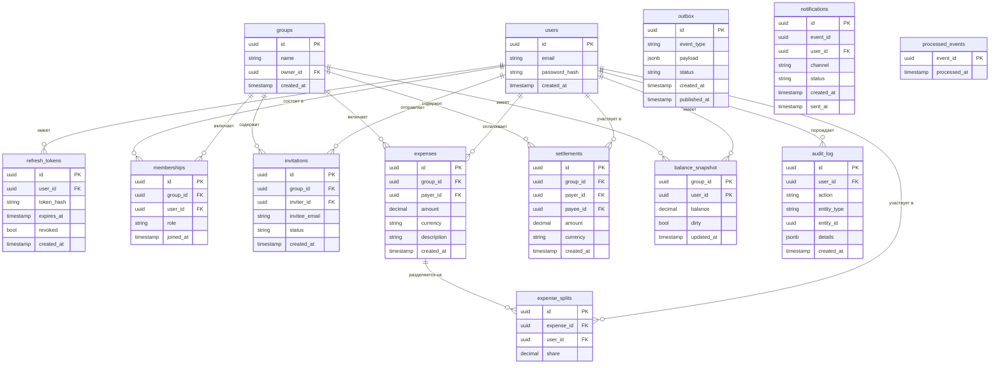

# 1.5 Проектирование базы данных

В качестве системы управления реляционными базами данных в разрабатываемом приложении применяется PostgreSQL — одна из наиболее зрелых и функционально насыщенных СУБД с открытым исходным кодом, поддерживающая полный набор гарантий ACID, расширенные типы данных и механизм логических схем [16]. Настоящий параграф посвящён проектированию структуры хранения данных: распределению сущностей по схемам, описанию ключевых таблиц и их связей, формулировке инвариантов данных, а также стратегии управления миграциями.

## 1.5.1 Принципы организации хранения данных

Концепция хранения данных строится на использовании единой физической базы данных PostgreSQL при обеспечении логической изоляции между сервисами через механизм схем. Данный подход согласуется с принятой сервисной архитектурой: каждый backend-сервис взаимодействует исключительно с собственной схемой и не имеет прямого доступа к таблицам других сервисов через SQL-запросы — взаимодействие между доменами осуществляется через HTTP-API или очередь сообщений [5].

Изоляция реализуется посредством раздельных пользователей PostgreSQL: каждому сервису соответствует отдельная роль в СУБД, наделённая привилегиями исключительно на собственную схему. Так, сервис аутентификации работает от пользователя `auth_user` с правами на схему `auth`, сервис групп — от `groups_user` на схему `groups`, а сервис расходов (`expenses-service`) и его фоновый обработчик (`expenses-worker`) совместно используют пользователя `expenses_user` на схему `expenses`. Сервис уведомлений эксплуатирует пользователя `notify_user` на схему `notify`.

Применение схем в рамках единой базы данных, а не отдельных баз данных на каждый сервис, обосновано несколькими соображениями. Во-первых, сокращаются операционные издержки: управление резервным копированием, мониторингом и конфигурацией выполняется централизованно. Во-вторых, сохраняется возможность применения транзакций при необходимости выполнить атомарные операции, затрагивающие несколько схем. В-третьих, PostgreSQL обеспечивает достаточный уровень изоляции через систему ролей и привилегий [9].

Единственным намеренным исключением из правила межсервисной изоляции является предоставление сервису расходов права `SELECT` на таблицу `groups.memberships`. Данное инженерное решение позволяет `expenses-service` проверять факт членства пользователя в группе непосредственно в SQL-запросе, избегая синхронного HTTP-вызова к `groups-service` на критическом пути создания расхода. Исключение задокументировано явно и ограничено минимально необходимым набором привилегий: только `SELECT`, только на одну таблицу.

Всего в базе данных предусмотрено четыре логические схемы:

- **auth** — данные пользователей и токены обновления;
- **groups** — группы, членство и приглашения;
- **expenses** — расходы, доли, взаиморасчёты, балансы и вспомогательные таблицы;
- **notify** — уведомления и журнал обработанных событий.

## 1.5.2 Схема auth

Схема `auth` содержит две таблицы, обеспечивающие хранение учётных данных пользователей и управление сессиями через механизм refresh-токенов.

Таблица `users` является центральным справочником пользователей системы. Первичный ключ `id` реализован как UUID-v4, генерируемый на уровне приложения, что исключает зависимость от последовательного инкремента и упрощает горизонтальное масштабирование. Поле `email` снабжено ограничением `UNIQUE` и `NOT NULL`; пароль хранится исключительно в виде хэша (`password_hash`), вычисленного по алгоритму bcrypt. Поле `created_at` фиксирует момент регистрации и заполняется автоматически функцией `now()`.

Таблица `refresh_tokens` связана с `users` внешним ключом `user_id` с каскадным удалением: при удалении пользователя все его токены удаляются автоматически. Хранится хэш токена (`token_hash`), а не сам токен, что предотвращает его компрометацию при утечке базы данных. Поля `expires_at` и `revoked` (булево значение, по умолчанию `false`) обеспечивают реализацию механизма ротации и принудительного отзыва токенов.

Связь между таблицами: `refresh_tokens.user_id → users.id` (многие-к-одному, каскадное удаление).

## 1.5.3 Схема groups

Схема `groups` содержит три таблицы, описывающие социальную структуру приложения: группы пользователей, членство в них и систему приглашений.

Таблица `groups` хранит базовые атрибуты группы: уникальный идентификатор `id` (UUID), наименование группы `name`, идентификатор владельца `owner_id` (ссылка на `auth.users.id`) и метку времени создания `created_at`. Поле `owner_id` не несёт операционной нагрузки для проверки прав доступа — авторизация осуществляется через таблицу `memberships`, — однако хранится для исторической атрибуции и быстрого определения первоначального создателя группы.

Таблица `memberships` реализует отношение многие-ко-многим между пользователями и группами. Помимо идентификаторов группы (`group_id`) и пользователя (`user_id`), таблица содержит поле `role` с перечислимым типом, принимающим одно из трёх значений: `owner`, `admin`, `member`. Пара (`group_id`, `user_id`) объявлена уникальной — один пользователь не может состоять в одной группе более чем с одной ролью. Поле `joined_at` фиксирует дату вступления.

Таблица `invitations` обеспечивает процедуру приглашения новых участников. Поле `invitee_email` хранит адрес электронной почты приглашаемого, не требуя его предварительной регистрации в системе. Поле `status` (перечислимый тип: `pending`, `accepted`, `declined`, `expired`) описывает жизненный цикл приглашения. Внешние ключи `group_id → groups.id` и `inviter_id → auth.users.id` обеспечивают ссылочную целостность.

## 1.5.4 Схема expenses

Схема `expenses` является наиболее сложной по структуре и содержит шесть таблиц, охватывающих весь жизненный цикл финансовых операций: от фиксации расхода до его учёта в балансе и публикации события.

**Денежная модель.** Все денежные значения в схеме хранятся с типом данных `DECIMAL` фиксированной точности (`NUMERIC(15, 2)`), а не `FLOAT`. Применение чисел с плавающей точкой для финансовых расчётов недопустимо ввиду накопления ошибок округления [5]. На уровне REST API денежные суммы передаются как целочисленные значения в минимальных единицах валюты (поле `amount_minor` типа `bigint` — копейки, центы); конвертация между API-представлением и типом `NUMERIC(15, 2)` выполняется в сервисном слое приложения и подробно описана в §1.6.5. Валюта фиксируется на уровне каждой операции полем `currency` (трёхбуквенный код ISO 4217), что обеспечивает возможность работы с многовалютными группами в будущем. Правила округления промежуточных значений при вычислении долей устанавливаются на уровне приложения: применяется метод «округления половины вверх» (ROUND_HALF_UP), а остаток от деления при неравном распределении зачисляется первому участнику в списке [9].

**Таблица `expenses`** фиксирует каждый расход группы. Основные поля: `id` (UUID), `group_id` (ссылка на `groups.groups.id`), `payer_id` (ссылка на `auth.users.id` — пользователь, фактически понёсший расход), `amount` (`DECIMAL`), `currency`, `description`, `created_at`. Ограничение `CHECK (amount > 0)` гарантирует, что сумма расхода положительна. Индексы предусмотрены на `group_id` и `created_at` для эффективной фильтрации истории расходов по группе.

**Таблица `expense_splits`** хранит распределение расхода по участникам. Каждая запись связывает расход (`expense_id → expenses.id`, каскадное удаление) с конкретным пользователем (`user_id`) и зафиксированной долей (`share DECIMAL`). Агрегатный инвариант — сумма всех `share` по одному `expense_id` равна `amount` соответствующего расхода — обеспечивается на уровне приложения при создании расхода в транзакции.

**Таблица `settlements`** регистрирует акты погашения задолженности между двумя участниками группы. Поля `payer_id` и `payee_id` ссылаются на `auth.users.id`; поле `group_id` привязывает расчёт к группе. Ограничение `CHECK (payer_id <> payee_id)` исключает самозачёт. Каждый settlement атомарно обновляет балансы обоих участников в рамках одной транзакции.

**Таблица `balance_snapshot`** реализует механизм кэширования актуального баланса пользователя в группе. Первичный ключ — составной (`group_id`, `user_id`). Поле `balance` хранит агрегированное сальдо пользователя: положительное значение означает, что группа должна пользователю, отрицательное — что пользователь должен группе. Попарные задолженности, возвращаемые эндпоинтом API `GET /balances`, вычисляются из таблиц `expenses`, `expense_splits` и `settlements` алгоритмом, описанным в §1.6.5; поле `dirty` служит индикатором необходимости полного пересчёта. Булево поле `dirty` сигнализирует о том, что баланс устарел и требует пересчёта. Фоновый сервис `expenses-worker` периодически пересчитывает балансы для всех записей с `dirty = true`, после чего сбрасывает флаг. При чтении баланса сервис расходов применяет стратегию read-through: если `dirty = true`, пересчёт выполняется немедленно в рамках запроса [5].

**Таблица `outbox`** реализует паттерн Transactional Outbox, обеспечивающий надёжную публикацию доменных событий в брокер сообщений [8]. Поля: `id` (UUID), `event_type` (строка, например `expense.created`), `payload` (тип `JSONB` — произвольный JSON-документ с данными события), `status` (перечислимый тип: `pending`, `delivered`), `created_at`, `published_at`. Запись в `outbox` производится в той же транзакции, что и запись в `expenses` или `settlements`, что гарантирует атомарность: либо расход создан и событие зафиксировано, либо ни то ни другое. Индекс на `(status, created_at)` обеспечивает эффективный опрос новых записей со стороны `expenses-worker`.

**Таблица `audit_log`** ведёт журнал всех значимых действий пользователей для целей аудита. Поля `entity_type` и `entity_id` идентифицируют объект воздействия, поле `action` — тип операции (например, `expense_created`, `settlement_confirmed`), `details` (тип `JSONB`) — произвольные дополнительные сведения. Записи в `audit_log` являются неизменяемыми: операции `UPDATE` и `DELETE` на эту таблицу запрещены на уровне привилегий роли `expenses_user`.

## 1.5.5 Схема notify

Схема `notify` обслуживает сервис уведомлений и содержит две таблицы.

Таблица `notifications` хранит записи об отправленных или запланированных уведомлениях. Поле `event_id` связывает уведомление с исходным событием из `outbox` схемы `expenses` (логическая связь, не внешний ключ, так как схемы принадлежат разным сервисам). Поле `user_id` указывает получателя уведомления, `channel` — канал доставки (например, `email`, `websocket`), `status` — состояние (перечислимый тип: `pending`, `sent`, `failed`). Поля `created_at` и `sent_at` фиксируют жизненный цикл уведомления.

Таблица `processed_events` обеспечивает идемпотентность обработки событий. Поле `event_id` (первичный ключ) хранит идентификатор каждого обработанного события. Перед обработкой очередного сообщения из RabbitMQ `notify-service` выполняет вставку в эту таблицу: если запись с данным `event_id` уже существует, вставка завершается с нарушением ограничения уникальности, и повторная обработка не происходит. Поле `processed_at` фиксирует время обработки. Данный механизм реализует семантику exactly-once на прикладном уровне при гарантии at-least-once со стороны брокера [8].

## 1.5.6 Инварианты данных

Корректность данных обеспечивается совокупностью ограничений на уровне СУБД и бизнес-логики приложения [9]. Основные инварианты представлены ниже.

**Инварианты, поддерживаемые средствами PostgreSQL:**

- `expense_splits.share > 0` — доля участника в расходе не может быть нулевой или отрицательной (ограничение `CHECK`);
- `expenses.amount > 0` — сумма расхода положительна (ограничение `CHECK`);
- `settlements.payer_id <> settlements.payee_id` — участник не может погашать долг самому себе (ограничение `CHECK`);
- ссылочная целостность между таблицами в пределах одной схемы обеспечивается внешними ключами с явно заданными действиями `ON DELETE` (`CASCADE` или `RESTRICT`);
- уникальность участника в группе: ограничение `UNIQUE (group_id, user_id)` в таблице `memberships`;
- уникальность факта обработки события: первичный ключ `event_id` в `processed_events`.

**Инварианты, поддерживаемые на уровне приложения:**

- сумма долей расхода равна сумме расхода: `SUM(expense_splits.share) = expenses.amount` — проверяется в транзакции создания расхода до фиксации изменений;
- участники расхода являются членами группы: `expense_splits.user_id ∈ memberships.user_id WHERE group_id = expense.group_id` — проверяется через `SELECT` к `groups.memberships` (задокументированное исключение изоляции);
- пользователь не может инициировать погашение долга вне своей группы — проверяется через принадлежность `settlement.group_id` к множеству групп пользователя;
- settlement не ссылается на несуществующую задолженность — корректность целевого баланса проверяется до записи settlement в транзакции.

## 1.5.7 Стратегия миграций (Alembic)

Управление схемой базы данных осуществляется посредством инструмента Alembic — стандартного решения для версионирования структуры PostgreSQL в экосистеме SQLAlchemy [24; 30]. Каждый сервис, взаимодействующий с базой данных, ведёт собственную независимую цепочку миграций в рамках своей схемы. Файлы миграций хранятся в каталоге `migrations/` внутри директории соответствующего сервиса и применяются автоматически при старте Docker-контейнера командой `alembic upgrade head`.

Выбранная стратегия обеспечивает следующие свойства:

- **Версионирование структуры.** Каждое изменение схемы (добавление таблицы, столбца, индекса, ограничения) фиксируется в отдельном файле миграции с уникальным идентификатором ревизии. История изменений воспроизводима и поддаётся аудиту через систему контроля версий.

- **Воспроизводимость развёртывания.** Состояние базы данных на любом окружении (разработческом, тестовом, продуктовом) однозначно определяется набором применённых миграций. Это исключает ситуации, при которых схема на продуктовом сервере расходится со схемой, описанной в коде [5].

- **Безопасный откат.** Каждая миграция содержит функции `upgrade()` и `downgrade()`, позволяющие при необходимости откатить изменение до предыдущей ревизии командой `alembic downgrade -1`.

- **Изоляция цепочек.** Независимость цепочек миграций по сервисам предотвращает конфликты при одновременном развитии нескольких сервисов. Сервис `expenses-worker` не поддерживает собственных миграций, поскольку использует схему `expenses`, миграции которой ведёт `expenses-service`.

Применение Alembic в связке с SQLAlchemy также позволяет использовать декларативные ORM-модели в качестве источника истины для автогенерации миграций командой `alembic revision --autogenerate`, что существенно снижает вероятность ошибок ручного написания DDL [30].

## ER-диаграмма

Взаимосвязи между основными сущностями системы представлены на диаграмме (Рисунок 1.2). На диаграмме отражены таблицы всех четырёх схем, а также их первичные ключи, внешние ключи и связи. Межсхемная ссылка `expenses-service → groups.memberships` обозначена пунктирной линией, подчёркивая её исключительный характер.

**Рисунок 1.2 — ER-диаграмма базы данных приложения**

---

Таким образом, в параграфе 1.5 спроектирована структура хранения данных разрабатываемого приложения. Принятая схема логической изоляции через именованные схемы PostgreSQL обеспечивает разграничение ответственности между сервисами при сохранении операционной простоты единой базы данных. Денежная модель на основе `DECIMAL` с фиксированной точностью и явными правилами округления исключает ошибки, характерные для вычислений с числами с плавающей точкой. Инварианты данных поддерживаются совокупностью ограничений СУБД и транзакционной логики приложения. Стратегия управления миграциями посредством Alembic обеспечивает версионируемость и воспроизводимость схемы на всех окружениях. В параграфе 1.6 на основе спроектированной структуры данных описываются REST API системы и финансовая модель алгоритма распределения расходов.
