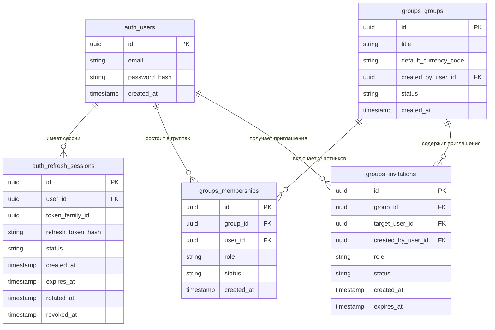
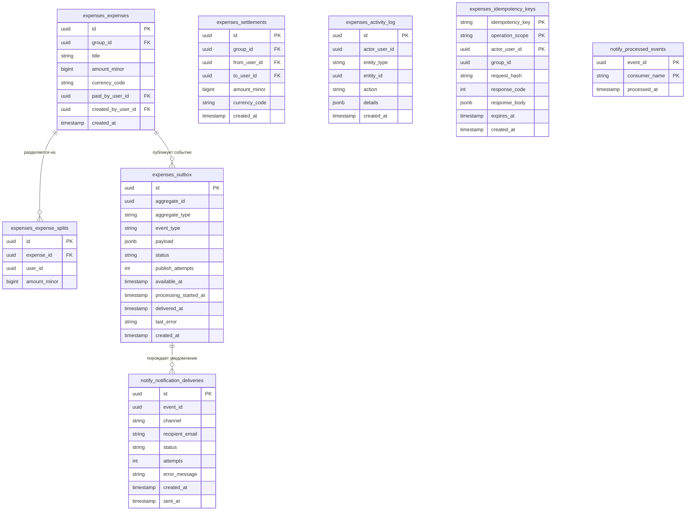

# 1.5 Проектирование базы данных

В качестве системы управления реляционными базами данных в разрабатываемом приложении применяется PostgreSQL — одна из наиболее зрелых и функционально насыщенных СУБД с открытым исходным кодом, поддерживающая полный набор гарантий ACID, расширенные типы данных и механизм логических схем [16]. Настоящий параграф посвящён проектированию структуры хранения данных: распределению сущностей по схемам, описанию ключевых таблиц и их связей, формулировке инвариантов данных, а также стратегии управления миграциями.

## 1.5.1 Принципы организации хранения данных

Концепция хранения данных строится на использовании единой физической базы данных PostgreSQL при обеспечении логической изоляции между сервисами через механизм схем. Данный подход согласуется с принятой сервисной архитектурой: каждый backend-сервис взаимодействует исключительно с собственной схемой и не имеет прямого доступа к таблицам других сервисов через SQL-запросы — взаимодействие между доменами осуществляется через HTTP-API или очередь сообщений [5].

Изоляция реализуется посредством раздельных пользователей PostgreSQL: каждому сервису соответствует отдельная роль в СУБД, наделённая привилегиями исключительно на собственную схему. Так, сервис аутентификации работает от пользователя `auth_user` с правами на схему `auth`, сервис групп — от `groups_user` на схему `groups`, а сервис расходов (`expenses-service`) и его фоновый обработчик (`expenses-worker`) совместно используют пользователя `expenses_user` на схему `expenses`. Сервис уведомлений эксплуатирует пользователя `notify_user` на схему `notify`.

Применение схем в рамках единой базы данных, а не отдельных баз данных на каждый сервис, обосновано несколькими соображениями. Во-первых, сокращаются операционные издержки: управление резервным копированием, мониторингом и конфигурацией выполняется централизованно. Во-вторых, сохраняется возможность применения транзакций при необходимости выполнить атомарные операции, затрагивающие несколько схем. В-третьих, PostgreSQL обеспечивает достаточный уровень изоляции через систему ролей и привилегий [9].

Единственным намеренным исключением из правила межсервисной изоляции является предоставление сервису расходов права `SELECT` на таблицу `groups.memberships`. Данное инженерное решение позволяет `expenses-service` проверять факт членства пользователя в группе непосредственно в SQL-запросе, избегая синхронного HTTP-вызова к `groups-service` на критическом пути создания расхода. Исключение задокументировано явно и ограничено минимально необходимым набором привилегий: только `SELECT`, только на одну таблицу.

Всего в базе данных предусмотрено четыре логические схемы:

- **auth** — данные пользователей и токены обновления;
- **groups** — группы, членство и приглашения;
- **expenses** — расходы, доли, взаиморасчёты, балансы и вспомогательные таблицы;
- **notify** — уведомления и журнал обработанных событий.

## 1.5.2 Схема auth

Схема `auth` содержит две таблицы, обеспечивающие хранение учётных данных пользователей и управление сессиями через механизм refresh-токенов.

Таблица `users` является центральным справочником пользователей системы. Первичный ключ `id` реализован как UUID-v4, генерируемый на уровне приложения, что исключает зависимость от последовательного инкремента и упрощает горизонтальное масштабирование. Поле `email` снабжено ограничением `UNIQUE` и `NOT NULL`; пароль хранится исключительно в виде хэша (`password_hash`), вычисленного по алгоритму **Argon2**. Выбор алгоритма обусловлен рекомендациями OWASP Password Storage Cheat Sheet [40] и его устойчивостью к атакам с применением GPU и специализированных ASIC: будучи memory-hard-функцией, Argon2 требует значительного объёма оперативной памяти при вычислении, что делает массовый перебор паролей экономически нецелесообразным даже при наличии специализированного оборудования. Поле `created_at` фиксирует момент регистрации и заполняется автоматически функцией `now()`.

Таблица `auth.refresh_sessions` связана с `users` внешним ключом `user_id` с каскадным удалением: при удалении пользователя все его сессии удаляются автоматически. Хранится хэш токена (`refresh_token_hash`), а не сам токен, что предотвращает его компрометацию при утечке базы данных. Схема сессии включает поля: `id` (PK), `user_id` (FK, CASCADE), `token_family_id` (UUID), `refresh_token_hash`, `status` (перечислимый тип: `active` / `rotated` / `revoked` / `compromised`), временны́е метки `created_at`, `expires_at`, `rotated_at`, `revoked_at`.

Ключевым проектным решением является реализация механизма **token-family rotation**. При каждом обновлении пары токенов создаётся новая запись `auth.refresh_sessions` с тем же значением `token_family_id`, что и у предыдущей; старая запись переводится в статус `rotated`, поле `rotated_at` заполняется. Если клиент предъявляет токен, уже помеченный как `rotated` или `revoked`, сервис расценивает это как признак компрометации: все записи с тем же `token_family_id` переводятся в статус `compromised`, что влечёт принудительное завершение всех активных сессий пользователя в данном семействе. В отличие от простой схемы с флагом `revoked: bool`, данный подход позволяет обнаружить факт повторного использования refresh-токена и своевременно нейтрализовать угрозу длительного применения украденных учётных данных. Подход соответствует общепринятым рекомендациям по безопасной ротации refresh-токенов.

Связь между таблицами: `auth.refresh_sessions.user_id → auth.users.id` (многие-к-одному, каскадное удаление).

Помимо `users` и `refresh_sessions`, схема `auth` включает служебную таблицу `audit_log` для фиксации значимых событий аутентификации (вход, отказ, ротация, отзыв сессии). Состав полей: `id`, `user_id` (nullable — для событий, не привязанных к конкретному пользователю), `action_type`, `data` (JSONB), `created_at`. Таблица предназначена для последующего разбора инцидентов безопасности и мониторинга подозрительной активности.

## 1.5.3 Схема groups

Схема `groups` содержит три таблицы, описывающие социальную структуру приложения: группы пользователей, членство в них и систему приглашений.

Таблица `groups` хранит базовые атрибуты группы: уникальный идентификатор `id` (UUID), наименование группы `title`, идентификатор создателя `created_by_user_id` (ссылка на `auth.users.id`), поле `default_currency_code` (трёхбуквенный код ISO 4217), перечислимый `status` (`active` / `archived`) и метку времени создания `created_at`. Поле `created_by_user_id` не несёт операционной нагрузки для проверки прав доступа — авторизация осуществляется через таблицу `memberships`, — однако хранится для исторической атрибуции и быстрого определения первоначального создателя группы. Поле `default_currency_code` устанавливает валюту по умолчанию для новых расходов группы, избавляя участников от необходимости указывать валюту при каждом добавлении расхода. Статус `archived` позволяет переводить завершённые поездки или совместные проекты в режим read-only: история расходов сохраняется в неизменном виде, но новые операции не принимаются.

Таблица `memberships` реализует отношение многие-ко-многим между пользователями и группами. Состав полей: суррогатный первичный ключ `id` (UUID), идентификаторы группы (`group_id`) и пользователя (`user_id`), поле `role` с перечислимым типом, принимающим одно из трёх значений: `owner`, `admin`, `member`, поле `status` (перечислимый тип `active` / `left` / `removed`), фиксирующее жизненный цикл участия, и временна́я метка `created_at`. Пара (`group_id`, `user_id`) объявлена уникальной — один пользователь не может состоять в одной группе более чем с одной записью членства. Введение явного поля `status` вместо физического удаления записи о вышедшем участнике сохраняет историческую атрибуцию: расходы и взаиморасчёты, в которых пользователь участвовал ранее, остаются согласованными по ссылочной целостности.

Таблица `invitations` обеспечивает процедуру приглашения новых участников. В реализованном варианте (v1) приглашения адресуются **только зарегистрированным пользователям** через поле `target_user_id`. Состав полей: `id`, `group_id`, `target_user_id` (ссылка на `auth.users.id`), `created_by_user_id` (пригласивший участник), `role` (роль, с которой приглашаемый войдёт в группу при принятии приглашения), `status` (перечислимый тип: `pending`, `accepted`, `declined`), `created_at`, `expires_at`. Поле `expires_at` определяет срок действия приглашения: по истечении установленного периода приглашение становится недействительным, что предотвращает накопление «висящих» записей и делает поведение системы предсказуемым. Внешние ключи `group_id → groups.id` и `target_user_id → auth.users.id` обеспечивают ссылочную целостность. Email-приглашения с автогенерацией одноразового токена (для пользователей, ещё не зарегистрированных в системе) предусмотрены как направление развития v2; в текущей реализации приглашение возможно только пользователю, уже создавшему аккаунт.

Дополнительно схема `groups` включает таблицу `audit_log` для журналирования организационных действий: создание группы, изменение состава участников, выдача и отзыв приглашений. Состав полей: `id`, `group_id` (nullable), `actor_user_id` (nullable — пользователь, инициировавший действие), `action_type`, `data` (JSONB), `created_at`. Назначение таблицы — отслеживание административных операций в группе и разбор спорных ситуаций между участниками.

## 1.5.4 Схема expenses

Схема `expenses` является наиболее сложной по структуре и содержит шесть таблиц, охватывающих весь жизненный цикл финансовых операций: от фиксации расхода и обеспечения идемпотентности операций до гарантированной публикации событий и ведения журнала активности. Таблицы схемы: `expenses`, `expense_splits`, `settlements`, `activity_log`, `idempotency_keys`, `outbox`. Кэширование агрегированных балансов (`balance_snapshot`) рассматривается как направление развития v2 и в текущей реализации не применяется; балансы вычисляются «на лету» из таблиц `expenses`, `expense_splits` и `settlements` алгоритмом, описанным в §1.6.5.

**Денежная модель.** Все денежные значения в схеме хранятся как `BigInteger amount_minor` — целое число в **минимальных единицах валюты** (копейки для RUB, центы для USD и EUR и т.д.). Тот же тип применяется на всём пути от базы данных до REST API без промежуточных конвертаций. Данное решение обеспечивает ряд существенных преимуществ: полностью исключаются ошибки округления, характерные для типов с плавающей точкой; достигается единообразная валидация на уровне API и БД через ограничение `CHECK (amount_minor > 0)`; сериализация в JSON упрощается, поскольку целое число представляется однозначно (в отличие от `DECIMAL`, трактовка которого разными JSON-библиотеками может расходиться); хранение оказывается более компактным по сравнению с `NUMERIC(15,2)`. Применение чисел с плавающей точкой для финансовых расчётов недопустимо ввиду накопления ошибок [5].

Валюта фиксируется на уровне каждой записи полем `currency_code` (трёхбуквенный код стандарта ISO 4217). Группа и расходы хранят валюту независимо: `groups.default_currency_code` задаёт значение по умолчанию для новых расходов, тогда как `expenses.currency_code` отражает фактическую валюту конкретного расхода. Правила округления промежуточных значений при вычислении долей устанавливаются в сервисном слое (`split_engine`): применяется метод «округления половины вверх» (ROUND_HALF_UP), а остаток от деления при неравном распределении зачисляется первому участнику в списке [9] (подробнее — §1.6.5).

**Таблица `expenses`** фиксирует каждый расход группы. Основные поля: `id` (UUID), `group_id` (ссылка на `groups.groups.id`), `title` (наименование расхода), `amount_minor` (BigInteger), `currency_code` (ISO 4217), `paid_by_user_id` (ссылка на `auth.users.id` — пользователь, фактически оплативший расход), `created_by_user_id` (ссылка на `auth.users.id` — пользователь, создавший запись). Разделение полей `paid_by_user_id` и `created_by_user_id` обеспечивает поддержку сценариев, при которых один участник вносит расход в систему от имени другого, а также даёт возможность точного аудита всех изменений. Ограничение `CHECK (amount_minor > 0)` гарантирует положительность суммы расхода. Индексы предусмотрены на `group_id` и `created_at` для эффективной фильтрации истории расходов по группе.

**Таблица `expense_splits`** хранит распределение расхода по участникам. Каждая запись связывает расход (`expense_id → expenses.id`, каскадное удаление) с конкретным пользователем (`user_id`) и зафиксированной долей (`amount_minor` — BigInteger в минимальных единицах валюты). Ограничение `CHECK (amount_minor > 0)` гарантирует положительность каждой доли. Агрегатный инвариант — сумма всех долей по одному `expense_id` равна `amount_minor` соответствующего расхода — обеспечивается на уровне приложения при создании расхода в транзакции.

**Таблица `settlements`** регистрирует акты погашения задолженности между двумя участниками группы. Поля `from_user_id` и `to_user_id` ссылаются на `auth.users.id`; поле `group_id` привязывает расчёт к группе. Ограничение `CHECK (from_user_id <> to_user_id)` исключает самозачёт — участник не может зафиксировать перевод средств самому себе. Каждый settlement атомарно обновляет балансы обоих участников в рамках одной транзакции.

**Таблица `idempotency_keys`** обеспечивает идемпотентность критичных POST-операций: `POST /expenses` и `POST /settlements`. Составной первичный ключ `(idempotency_key, operation_scope, actor_user_id)` исключает коллизии между пользователями и различными типами операций: `idempotency_key` приходит от клиента в HTTP-заголовке `Idempotency-Key` согласно IETF-драфту [38], `operation_scope` различает идемпотентность в разрезе типа операции, `actor_user_id` привязывает ключ к конкретному пользователю. Дополнительно хранятся: `request_hash` — SHA-256 хэш тела запроса для обнаружения повторного запроса с тем же ключом, но другим телом (что является ошибкой клиента); `response_code` и `response_body` — закэшированный ответ исходной операции, возвращаемый при повторном запросе вместо повторного исполнения бизнес-логики; `group_id` — для аудита и быстрой выборки идемпотентных ключей, относящихся к конкретной группе; `expires_at` — момент истечения хранимого ответа; `created_at` — временна́я метка создания записи.

**Таблица `outbox`** реализует паттерн Transactional Outbox, обеспечивающий надёжную публикацию доменных событий в брокер сообщений [8]. Запись в `outbox` производится в той же транзакции, что и запись в `expenses` или `settlements`, что гарантирует атомарность: либо расход создан и событие зафиксировано, либо ни то ни другое.

Применяется расширенная двухфазная схема публикации, более устойчивая к временным сбоям брокера, чем простая пара `pending/delivered`. Состав таблицы: `id` (UUID), `aggregate_id` (идентификатор бизнес-сущности, инициировавшей событие), `aggregate_type` (тип сущности), `event_type` (имя события, например `expense.created`), `payload` (JSONB), `status` (перечислимый тип: `pending` / `processing` / `delivered` / `failed`), `publish_attempts` (счётчик попыток), `available_at` (момент, начиная с которого событие доступно для следующей попытки публикации), `processing_started_at`, `delivered_at`, `last_error`.

Роль нестандартных полей принципиальна. Статус `processing` проставляется worker'ом при взятии события в обработку; watchdog может обнаруживать «зависшие» события, остающиеся в этом статусе сверх допустимого времени. Совместное применение `publish_attempts` и `available_at` реализует **экспоненциальную задержку между попытками**: при каждом неуспехе счётчик инкрементируется, а `available_at` сдвигается на величину, экспоненциально зависящую от числа попыток (согласно ADR-003). Поле `last_error` сохраняет диагностику последнего отказа. Статус `failed` присваивается событию, исчерпавшему лимит попыток, и направляет его на ручной разбор — это аналог Dead Letter Queue, реализованный на уровне базы данных. Индекс на `(status, available_at)` обеспечивает эффективную выборку событий, готовых к обработке.

**Таблица `activity_log`** ведёт журнал всех значимых действий пользователей. Поля `entity_type` и `entity_id` идентифицируют объект воздействия, поле `action_type` — тип операции (например, `expense_created`, `settlement_confirmed`), `details` (тип `JSONB`) — произвольные дополнительные сведения. Append-only-режим работы с `activity_log` обеспечивается на уровне сервисного слоя `expenses-service`: операции `UPDATE` и `DELETE` для данной таблицы в коде приложения не предусмотрены. На уровне СУБД запрет этих операций через `REVOKE` для роли `expenses_user` в текущей реализации не вводится; такое усиление рассматривается как направление развития для production-конфигурации.

## 1.5.5 Схема notify

Схема `notify` обслуживает сервис уведомлений и содержит две таблицы.

Таблица `notification_deliveries` хранит записи об отправленных или запланированных уведомлениях. Поле `event_id` связывает уведомление с исходным доменным событием из схемы `expenses` (логическая связь, не внешний ключ, так как схемы принадлежат разным сервисам). Поле `channel` определяет канал доставки (в текущей реализации — `email`), `recipient_email` — адрес получателя. Поле `status` описывает состояние доставки (перечислимый тип: `pending`, `sent`, `failed`). Поле `attempts` ведёт счётчик попыток отправки; `error_message` сохраняет текст последней ошибки для диагностики. Временны́е метки фиксируют жизненный цикл уведомления.

Таблица `processed_events` обеспечивает идемпотентность обработки событий. Первичный ключ таблицы является **составным**: `(event_id, consumer_name)`. Такой выбор обусловлен перспективой масштабирования: при появлении дополнительного потребителя тех же событий (например, аналитического сервиса) каждый consumer ведёт собственный независимый реестр обработанных событий — их записи не пересекаются и не блокируют друг друга. В текущей реализации consumer один (`notify-service`), однако схема уже подготовлена к расширению без изменения структуры таблицы. Перед обработкой очередного сообщения из RabbitMQ `notify-service` выполняет вставку с указанием `consumer_name`: если запись с данной парой уже существует, вставка завершается с нарушением ограничения уникальности, и повторная обработка не происходит. Поле `processed_at` фиксирует время обработки. Данный механизм реализует семантику exactly-once на прикладном уровне при гарантии at-least-once со стороны брокера [8].

## 1.5.6 Инварианты данных

Корректность данных обеспечивается совокупностью ограничений на уровне СУБД и бизнес-логики приложения [9]. Основные инварианты представлены ниже.

**Инварианты, поддерживаемые средствами PostgreSQL:**

- `expense_splits.amount_minor > 0` — доля участника в расходе не может быть нулевой или отрицательной (ограничение `CHECK`);
- `expenses.amount_minor > 0` — сумма расхода положительна (ограничение `CHECK`);
- `settlements.from_user_id <> settlements.to_user_id` — участник не может погашать долг самому себе (ограничение `CHECK`);
- ссылочная целостность между таблицами в пределах одной схемы обеспечивается внешними ключами с явно заданными действиями `ON DELETE` (`CASCADE` или `RESTRICT`);
- уникальность участника в группе: ограничение `UNIQUE (group_id, user_id)` в таблице `memberships`;
- уникальность факта обработки события конкретным потребителем: составной первичный ключ `(event_id, consumer_name)` в `processed_events`.

**Инварианты, поддерживаемые на уровне приложения:**

- сумма долей расхода равна сумме расхода: `SUM(expense_splits.amount_minor) = expenses.amount_minor` — проверяется в транзакции создания расхода до фиксации изменений;
- участники расхода являются членами группы: `expense_splits.user_id ∈ memberships.user_id WHERE group_id = expense.group_id` — проверяется через `SELECT` к `groups.memberships` (задокументированное исключение изоляции);
- пользователь не может инициировать погашение долга вне своей группы — проверяется через принадлежность `settlement.group_id` к множеству групп пользователя;
- settlement не ссылается на несуществующую задолженность — корректность целевого баланса проверяется до записи settlement в транзакции.

## 1.5.7 Стратегия миграций (Alembic)

Управление схемой базы данных осуществляется посредством инструмента Alembic — стандартного решения для версионирования структуры PostgreSQL в экосистеме SQLAlchemy [24, 30]. Каждый сервис, взаимодействующий с базой данных, ведёт собственную независимую цепочку миграций в рамках своей схемы. Файлы миграций хранятся в каталоге `migrations/` внутри директории соответствующего сервиса.

Миграции применяются **явной командой** перед приёмом трафика: `make auth-migrate`, `make groups-migrate`, `make expenses-migrate`, `make notify-migrate`. Это сознательное архитектурное решение, защищающее от автоматического применения миграций при каждом перезапуске контейнера — ситуация, потенциально опасная в CI/CD-пайплайне или production-окружении, где непредвиденный запуск DDL-операций может нарушить целостность схемы. ENTRYPOINT сервисного контейнера не запускает `alembic upgrade` автоматически.

Отказ от auto-apply компенсируется механизмом **schema-guard**: при старте каждого сервиса метаданные ORM-моделей SQLAlchemy сравниваются с фактической схемой PostgreSQL. При обнаружении расхождения — например, если миграция не была применена или применена устаревшая ревизия — сервис переходит в состояние `readiness=503` и не принимает трафик до устранения дрейфа схемы. Тем самым обеспечивается невозможность работы сервиса с несоответствующей структурой базы данных.

Выбранная стратегия обеспечивает следующие свойства:

- **Версионирование структуры.** Каждое изменение схемы (добавление таблицы, столбца, индекса, ограничения) фиксируется в отдельном файле миграции с уникальным идентификатором ревизии. История изменений воспроизводима и поддаётся аудиту через систему контроля версий.

- **Воспроизводимость развёртывания.** Состояние базы данных на любом окружении (разработческом, тестовом, продуктовом) однозначно определяется набором применённых миграций. Это исключает ситуации, при которых схема на продуктовом сервере расходится со схемой, описанной в коде [5].

- **Безопасный откат.** Каждая миграция содержит функции `upgrade()` и `downgrade()`, позволяющие при необходимости откатить изменение до предыдущей ревизии командой `alembic downgrade -1`.

- **Изоляция цепочек.** Независимость цепочек миграций по сервисам предотвращает конфликты при одновременном развитии нескольких сервисов. Сервис `expenses-worker` не поддерживает собственных миграций, поскольку использует схему `expenses`, миграции которой ведёт `expenses-service`.

Применение Alembic в связке с SQLAlchemy также позволяет использовать декларативные ORM-модели в качестве источника истины для автогенерации миграций командой `alembic revision --autogenerate`, что существенно снижает вероятность ошибок ручного написания DDL [30].

## ER-диаграмма

Взаимосвязи между сущностями системы представлены двумя диаграммами. Первая (Рисунок 1.2) охватывает схемы `auth` и `groups`; вторая (Рисунок 1.3) — схемы `expenses` и `notify`. Разбиение обусловлено числом таблиц и объёмом межтабличных связей: совмещение всех четырёх схем на одной диаграмме привело бы к её нечитаемости. Межсхемные внешние ключи (в частности, `expenses.group_id → groups.groups.id` и `settlements.group_id → groups.groups.id`) в самих диаграммах не отрисовываются; соответствующие ограничения упомянуты в тексте параграфов §1.5.3 и §1.5.4.

**Рисунок 1.2 — ER-диаграмма схем `auth` и `groups`**

**Рисунок 1.3 — ER-диаграмма схем `expenses` и `notify`**

---

Таким образом, в параграфе 1.5 спроектирована структура хранения данных разрабатываемого приложения. Принятая схема логической изоляции через именованные схемы PostgreSQL обеспечивает разграничение ответственности между сервисами при сохранении операционной простоты единой базы данных. Денежная модель на основе целочисленного типа `BigInteger amount_minor` исключает ошибки округления, характерные для вычислений с числами с плавающей точкой, и устраняет необходимость промежуточных конвертаций между слоями системы. Инварианты данных поддерживаются совокупностью ограничений СУБД и транзакционной логики приложения. Управление миграциями через явные команды в связке с механизмом schema-guard обеспечивает контролируемое применение изменений схемы и гарантирует соответствие структуры базы данных ожиданиям сервисов. В параграфе 1.6 на основе спроектированной структуры данных описываются REST API системы и финансовая модель алгоритма распределения расходов.
